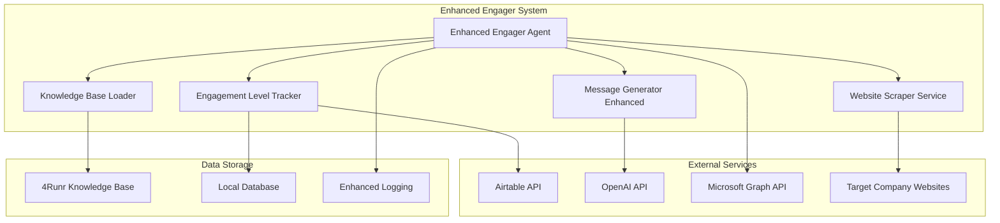

# Design Document

## Overview

The 4Runr Email Engager Upgrade enhances the existing `EngagerAgent` class in the 4runr-outreach-system to incorporate 4Runr's knowledge base, company-focused personalization, engagement level tracking, and autonomous deployment capabilities. The design builds upon the current Microsoft Graph email delivery, Airtable integration, and logging infrastructure while adding strategic intelligence and improved tracking.

The upgrade maintains backward compatibility with the existing system while adding new capabilities through modular enhancements. The enhanced system will operate autonomously with improved personalization, better engagement tracking, and deployment-ready error handling.

## Architecture

### High-Level Architecture



### Core Components

1. **Enhanced Engager Agent**: Extended `EngagerAgent` class with new capabilities
2. **Knowledge Base Loader**: Loads and manages 4Runr knowledge base content
3. **Website Scraper Service**: Scrapes and summarizes target company websites
4. **Engagement Level Tracker**: Manages Airtable "Level Engaged" field and local database tracking
5. **Message Generator Enhanced**: AI-powered message generation with 4Runr knowledge and company context

## Components and Interfaces

### Enhanced Engager Agent

The core `EngagerAgent` class will be extended with new capabilities while maintaining the existing interface:

```python
class EnhancedEngagerAgent(EngagerAgent):
    def __init__(self):
        super().__init__()
        self.knowledge_base_loader = KnowledgeBaseLoader()
        self.website_scraper = WebsiteScraperService()
        self.engagement_tracker = EngagementLevelTracker()
        self.message_generator = MessageGeneratorEnhanced()
        self._4runr_knowledge = None
    
    def process_leads(self, limit: int = None) -> Dict[str, int]:
        """Enhanced lead processing with 4Runr knowledge and company personalization"""
        
    def _process_single_lead_enhanced(self, lead: Dict[str, Any]) -> str:
        """Enhanced single lead processing with full upgrade features"""
        
    def _should_engage_lead_enhanced(self, lead: Dict[str, Any]) -> bool:
        """Enhanced lead validation including engagement level checks"""
```

### Knowledge Base Loader

Manages loading and caching of 4Runr knowledge base content:

```python
class KnowledgeBaseLoader:
    def __init__(self, knowledge_path: str = "data/4runr_knowledge.md"):
        self.knowledge_path = knowledge_path
        self._cached_knowledge = None
        self._last_loaded = None
    
    def load_knowledge_base(self) -> str:
        """Load 4Runr knowledge base content with caching and error handling"""
        
    def get_knowledge_summary(self) -> Dict[str, str]:
        """Extract key knowledge components for message generation"""
        
    def validate_knowledge_base(self) -> bool:
        """Validate knowledge base content and structure"""
```

### Website Scraper Service

Handles company website scraping and summarization:

```python
class WebsiteScraperService:
    def __init__(self):
        self.scraping_config = config.get_scraping_config()
        self.openai_client = OpenAI()
    
    def scrape_company_website(self, website_url: str) -> Dict[str, Any]:
        """Scrape and summarize company website content"""
        
    def _extract_website_content(self, url: str) -> str:
        """Extract clean text content from website"""
        
    def _summarize_company_info(self, content: str, company_name: str) -> str:
        """Use AI to summarize company information for personalization"""
        
    def _validate_website_url(self, url: str) -> bool:
        """Validate and normalize website URL"""
```

### Engagement Level Tracker

Manages engagement level progression and database synchronization:

```python
class EngagementLevelTracker:
    def __init__(self):
        self.airtable_client = get_airtable_client()
        self.db_manager = LocalDatabaseManager()
        self.engagement_levels = ['1st degree', '2nd degree', '3rd degree', 'retry']
    
    def get_current_engagement_level(self, lead: Dict[str, Any]) -> str:
        """Get current engagement level from Airtable"""
        
    def should_skip_lead(self, lead: Dict[str, Any]) -> bool:
        """Determine if lead should be skipped based on engagement level"""
        
    def update_engagement_level(self, lead_id: str, current_level: str) -> bool:
        """Update engagement level to next stage in both Airtable and local DB"""
        
    def get_next_engagement_level(self, current_level: str) -> Optional[str]:
        """Determine next engagement level in progression"""
        
    def sync_to_local_database(self, lead_id: str, engagement_data: Dict[str, Any]) -> bool:
        """Update local database with engagement information"""
```

### Message Generator Enhanced

AI-powered message generation with 4Runr knowledge and company context:

```python
class MessageGeneratorEnhanced:
    def __init__(self):
        self.openai_client = OpenAI()
        self.ai_config = config.get_ai_config()
    
    def generate_personalized_message(self, lead: Dict[str, Any], 
                                    knowledge_base: str, 
                                    company_summary: str,
                                    engagement_level: str) -> str:
        """Generate personalized message with 4Runr knowledge and company context"""
        
    def _build_message_prompt(self, lead: Dict[str, Any], 
                            knowledge_base: str, 
                            company_summary: str,
                            engagement_level: str) -> str:
        """Build comprehensive prompt for AI message generation"""
        
    def _get_tone_for_engagement_level(self, engagement_level: str) -> str:
        """Get appropriate tone and approach for engagement level"""
        
    def _validate_message_quality(self, message: str, lead: Dict[str, Any]) -> bool:
        """Validate generated message meets 4Runr standards"""
```

### Local Database Manager

Handles local database operations for engagement tracking:

```python
class LocalDatabaseManager:
    def __init__(self):
        self.db_path = "data/leads_cache.db"
        self._ensure_schema()
    
    def _ensure_schema(self) -> None:
        """Ensure database has required engagement tracking fields"""
        
    def update_engagement_data(self, lead_id: str, engagement_data: Dict[str, Any]) -> bool:
        """Update local database with engagement information"""
        
    def get_engagement_history(self, lead_id: str) -> List[Dict[str, Any]]:
        """Retrieve engagement history for a lead"""
        
    def create_engagement_tables(self) -> bool:
        """Create engagement tracking tables if they don't exist"""
```

## Data Models

### Enhanced Lead Processing Data

Extended data structures for enhanced processing:

```python
@dataclass
class EnhancedLeadData:
    # Existing lead fields
    lead_id: str
    name: str
    email: str
    company: str
    company_website: str
    
    # New enhancement fields
    engagement_level: str
    company_summary: str
    knowledge_base_content: str
    personalized_message: str
    last_contacted: datetime
    engagement_history: List[Dict[str, Any]]
```

### Engagement Level Configuration

Configuration for engagement level progression:

```python
@dataclass
class EngagementLevelConfig:
    level_name: str
    display_name: str
    message_tone: str
    next_level: Optional[str]
    skip_if_reached: bool
    
ENGAGEMENT_LEVELS = {
    '1st degree': EngagementLevelConfig(
        level_name='1st degree',
        display_name='First Contact',
        message_tone='insightful_introduction',
        next_level='2nd degree',
        skip_if_reached=False
    ),
    '2nd degree': EngagementLevelConfig(
        level_name='2nd degree',
        display_name='Strategic Follow-up',
        message_tone='strategic_nudge',
        next_level='3rd degree',
        skip_if_reached=False
    ),
    '3rd degree': EngagementLevelConfig(
        level_name='3rd degree',
        display_name='Challenge/Urgency',
        message_tone='challenge_urgency',
        next_level='retry',
        skip_if_reached=False
    ),
    'retry': EngagementLevelConfig(
        level_name='retry',
        display_name='Final Attempt',
        message_tone='bold_last_pitch',
        next_level=None,
        skip_if_reached=True
    )
}
```

### Database Schema Extensions

New database fields for engagement tracking:

```sql
-- Add to existing leads table or create engagement_tracking table
ALTER TABLE leads ADD COLUMN engagement_stage TEXT DEFAULT '1st degree';
ALTER TABLE leads ADD COLUMN last_contacted TIMESTAMP;
ALTER TABLE leads ADD COLUMN engagement_history TEXT; -- JSON format

-- Optional: Create dedicated engagement tracking table
CREATE TABLE IF NOT EXISTS engagement_tracking (
    id INTEGER PRIMARY KEY AUTOINCREMENT,
    lead_id TEXT NOT NULL,
    engagement_level TEXT NOT NULL,
    contacted_at TIMESTAMP DEFAULT CURRENT_TIMESTAMP,
    message_sent TEXT,
    company_summary TEXT,
    success BOOLEAN DEFAULT TRUE,
    FOREIGN KEY (lead_id) REFERENCES leads(id)
);
```

## Error Handling

### Knowledge Base Error Handling

Robust handling of knowledge base loading issues:

```python
class KnowledgeBaseError(Exception):
    """Custom exception for knowledge base issues"""
    pass

def load_knowledge_base_with_fallback(self) -> str:
    """Load knowledge base with fallback to default 4Runr principles"""
    try:
        return self._load_from_file()
    except FileNotFoundError:
        self.logger.log_module_activity('engager', 'system', 'warning', 
                                       {'message': 'Knowledge base file not found, using fallback'})
        return self._get_fallback_knowledge()
    except Exception as e:
        self.logger.log_error(e, {'action': 'load_knowledge_base'})
        return self._get_fallback_knowledge()
```

### Website Scraping Error Handling

Graceful degradation for website scraping failures:

```python
def scrape_with_fallback(self, website_url: str, company_name: str) -> str:
    """Scrape website with fallback to company name only"""
    try:
        return self._scrape_and_summarize(website_url)
    except requests.RequestException:
        self.logger.log_module_activity('engager', 'system', 'warning',
                                       {'message': f'Website scraping failed for {website_url}'})
        return f"Company: {company_name} (website content unavailable)"
    except Exception as e:
        self.logger.log_error(e, {'action': 'scrape_website', 'url': website_url})
        return f"Company: {company_name}"
```

### Database Error Handling

Resilient database operations with transaction rollback:

```python
def update_with_transaction(self, lead_id: str, engagement_data: Dict[str, Any]) -> bool:
    """Update engagement data with transaction safety"""
    try:
        with sqlite3.connect(self.db_path) as conn:
            conn.execute("BEGIN TRANSACTION")
            
            # Update local database
            self._update_local_engagement(conn, lead_id, engagement_data)
            
            # Update Airtable
            airtable_success = self._update_airtable_engagement(lead_id, engagement_data)
            
            if airtable_success:
                conn.execute("COMMIT")
                return True
            else:
                conn.execute("ROLLBACK")
                return False
                
    except Exception as e:
        self.logger.log_error(e, {'action': 'update_engagement', 'lead_id': lead_id})
        return False
```

## Testing Strategy

### Unit Testing

Comprehensive unit tests for all new components:

```python
class TestKnowledgeBaseLoader(unittest.TestCase):
    def test_load_valid_knowledge_base(self):
        """Test loading valid knowledge base file"""
        
    def test_fallback_on_missing_file(self):
        """Test fallback behavior when knowledge base file is missing"""
        
    def test_knowledge_base_validation(self):
        """Test validation of knowledge base content"""

class TestWebsiteScraperService(unittest.TestCase):
    def test_successful_website_scraping(self):
        """Test successful website content extraction"""
        
    def test_scraping_failure_fallback(self):
        """Test fallback behavior on scraping failure"""
        
    def test_ai_summarization(self):
        """Test AI-powered company information summarization"""

class TestEngagementLevelTracker(unittest.TestCase):
    def test_engagement_level_progression(self):
        """Test proper progression through engagement levels"""
        
    def test_skip_over_engaged_leads(self):
        """Test skipping leads that have reached maximum engagement"""
        
    def test_database_synchronization(self):
        """Test synchronization between Airtable and local database"""
```

### Integration Testing

End-to-end testing of the enhanced system:

```python
class TestEnhancedEngagerIntegration(unittest.TestCase):
    def test_complete_lead_processing_flow(self):
        """Test complete flow from lead selection to message sending"""
        
    def test_knowledge_base_integration(self):
        """Test integration of 4Runr knowledge base in message generation"""
        
    def test_company_personalization_flow(self):
        """Test website scraping and company-focused personalization"""
        
    def test_engagement_level_tracking(self):
        """Test proper tracking and updating of engagement levels"""
```

### Load Testing

Performance testing for autonomous operation:

```python
class TestSystemPerformance(unittest.TestCase):
    def test_batch_processing_performance(self):
        """Test system performance with large batches of leads"""
        
    def test_concurrent_processing(self):
        """Test system behavior under concurrent processing loads"""
        
    def test_error_recovery_performance(self):
        """Test system recovery time from various error conditions"""
```

## Security Considerations

### Data Protection

- **Knowledge Base Security**: Secure storage and access to proprietary 4Runr knowledge
- **Website Scraping Compliance**: Respect robots.txt and rate limiting
- **Database Encryption**: Encrypt sensitive engagement data at rest
- **API Key Management**: Secure handling of OpenAI and Microsoft Graph credentials

### Privacy Compliance

- **Data Minimization**: Store only necessary company information from scraping
- **Retention Policies**: Implement configurable data retention for engagement history
- **Consent Management**: Respect opt-out preferences in engagement tracking
- **Audit Logging**: Comprehensive logging of all data access and modifications

## Performance Optimization

### Caching Strategy

- **Knowledge Base Caching**: Cache loaded knowledge base content in memory
- **Website Content Caching**: Cache scraped website summaries to avoid re-scraping
- **Engagement Level Caching**: Cache current engagement levels to reduce Airtable calls
- **Message Template Caching**: Cache common message components for faster generation

### Database Optimization

- **Connection Pooling**: Efficient database connection management
- **Batch Operations**: Batch database updates for better performance
- **Index Optimization**: Proper indexing on engagement tracking queries
- **Query Optimization**: Minimize database round trips with optimized queries

### API Rate Limiting

- **OpenAI Rate Limiting**: Implement proper rate limiting for AI API calls
- **Airtable Rate Limiting**: Respect Airtable API rate limits with exponential backoff
- **Microsoft Graph Rate Limiting**: Handle Graph API throttling gracefully
- **Website Scraping Rate Limiting**: Implement delays between website requests

## Deployment Considerations

### Environment Configuration

Enhanced environment variables for new features:

```bash
# 4Runr Knowledge Base
KNOWLEDGE_BASE_PATH=data/4runr_knowledge.md

# Website Scraping
WEBSITE_SCRAPING_ENABLED=true
SCRAPING_TIMEOUT=30
SCRAPING_USER_AGENT="4Runr Outreach Bot 1.0"

# Engagement Tracking
ENGAGEMENT_TRACKING_ENABLED=true
LOCAL_DB_PATH=data/leads_cache.db
ENGAGEMENT_HISTORY_RETENTION_DAYS=365

# AI Enhancement
AI_SUMMARIZATION_ENABLED=true
MESSAGE_QUALITY_VALIDATION=true
```

### Docker Configuration

Updated Docker configuration for enhanced system:

```dockerfile
# Add new dependencies
RUN pip install beautifulsoup4 requests-html sqlite3

# Copy knowledge base
COPY data/4runr_knowledge.md /app/data/

# Create database directory
RUN mkdir -p /app/data && chmod 755 /app/data

# Health check for enhanced system
HEALTHCHECK --interval=30s --timeout=10s --start-period=5s --retries=3 \
  CMD python -c "from engager.app import EnhancedEngagerAgent; agent = EnhancedEngagerAgent(); print('OK')"
```

### Monitoring and Alerting

Enhanced monitoring for new capabilities:

- **Knowledge Base Health**: Monitor knowledge base file availability and validity
- **Website Scraping Success Rate**: Track scraping success/failure rates
- **Engagement Level Distribution**: Monitor distribution of leads across engagement levels
- **Message Quality Metrics**: Track AI-generated message quality scores
- **Database Synchronization**: Monitor sync status between Airtable and local database

### Rollback Strategy

Safe deployment with rollback capabilities:

- **Feature Flags**: Enable/disable enhanced features independently
- **Database Migration Rollback**: Reversible database schema changes
- **Configuration Rollback**: Quick reversion to previous configuration
- **Gradual Rollout**: Phased deployment with monitoring at each stage