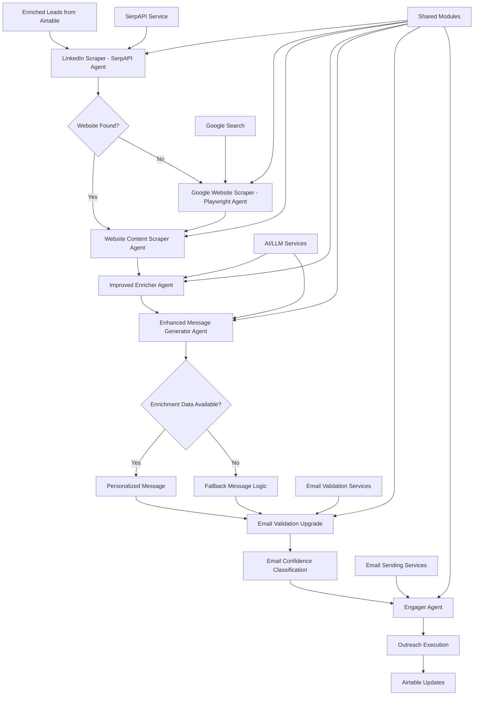
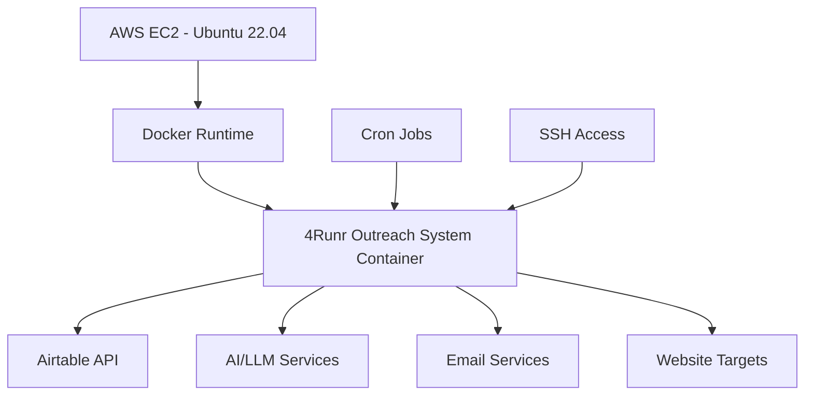

# Design Document: 4Runr Autonomous Outreach System

## Overview

The 4Runr Autonomous Outreach System is an intelligent lead engagement platform that transforms enriched lead data into personalized outreach campaigns. The system consists of four autonomous modules that work together to scrape company websites, generate custom messages, validate email addresses, and execute outreach while maintaining comprehensive logging in Airtable. The system ensures only validated leads receive outreach and maintains 4Runr's helpful, strategic brand voice throughout all communications.

## Architecture

The system follows a modular autonomous architecture where each module can operate independently while working together in a coordinated pipeline. The system processes enriched leads from Airtable through seven specialized modules:

1. **LinkedIn Scraper (SerpAPI Agent)**: Extracts website URLs from SerpAPI responses
2. **Google Website Scraper (Playwright Agent)**: Fallback Google search for missing websites
3. **Website Content Scraper Agent**: Extracts company information from discovered websites
4. **Improved Enricher Agent**: Uses website content to extract business traits and insights
5. **Enhanced Message Generator Agent**: Creates personalized outreach with fallback logic
6. **Email Validation Upgrade**: Classifies email confidence levels
7. **Engager Agent**: Sends messages only to validated email addresses



## Components and Interfaces

### 1. LinkedIn Scraper (SerpAPI Agent)

The LinkedIn Scraper extracts website URLs from SerpAPI responses during the lead scraping process.

**Interface:**
- `extract_website_from_serpapi(serpapi_response)`: Extracts website field from SerpAPI JSON response
- `update_lead_website(lead_dict, website_url)`: Adds website to scraped lead dictionary
- `save_website_to_airtable(lead_id, website_url)`: Updates Airtable with discovered website

**Implementation Details:**
- Integrates with existing SerpAPI response parsing logic in 4runr-lead-scraper
- Extracts website field if present in SerpAPI response JSON
- Sets "Website": website_url in scraped lead dictionary when found
- Sets "Website": None when not found to trigger fallback Google scraping
- Maintains existing scraper functionality without breaking changes
- Uses existing Airtable integration to write Website field

### 2. Google Website Scraper (Playwright Agent)

The Google Website Scraper performs fallback Google searches to find company websites when SerpAPI doesn't provide them.

**Interface:**
- `search_google_for_website(full_name, company_name)`: Performs Google search for company website
- `parse_organic_results(search_results)`: Extracts URL from first organic result
- `validate_website_url(url)`: Validates discovered URL format and accessibility
- `update_enrichment_status(lead_id, status)`: Updates status when website search fails

**Implementation Details:**
- Located in 4runr-agents/shared/google_scraper.py or similar modular path
- Uses Playwright for Google search automation
- Implements search query: "{full_name}" "{company_name}" site:.com OR site:.ca
- Parses first organic result (excludes ads) to extract website URL
- Only executes when lead.get("Website") is None or empty string
- Updates Airtable Website field with discovered URL
- Sets Enrichment Status = "Failed - No Website" when no results found

### 3. Website Content Scraper Agent

The Website Content Scraper Agent extracts company information from discovered websites to provide context for personalized outreach.

**Interface:**
- `scrape_company_website(website_url)`: Scrapes website content and extracts key information
- `extract_company_description(content)`: Generates brief company summary from About/Home pages
- `extract_top_services(content)`: Identifies key services or offerings
- `analyze_website_tone(content)`: Estimates company communication tone
- `clean_content(raw_content)`: Removes navigation, footer, and cookie banner text

**Implementation Details:**
- Uses existing scraper module from 4runr-agents architecture
- Prioritizes /about, /services, /home, and /contact pages
- Implements fallback logic for non-standard website structures
- Applies content cleaning algorithms to focus on meaningful text
- Stores raw scraped sections as Website_Insights for context
- Updates Airtable with Company_Description, Top_Services, Tone, and Website_Insights

### 4. Improved Enricher Agent

The Improved Enricher Agent uses website content to extract business traits, pain points, and insights for targeted outreach.

**Interface:**
- `enrich_lead_with_website(lead_data, website_url)`: Enriches lead using website content
- `extract_business_type(website_content)`: Identifies business category (B2B SaaS, e-commerce, law firm, etc.)
- `identify_business_traits(website_content)`: Extracts traits (local service, AI-powered, needs automation)
- `infer_pain_points(website_content)`: Identifies pain points from messaging and product descriptions
- `cache_enrichment_results(lead_id, enrichment_data)`: Saves results to avoid re-processing

**Implementation Details:**
- Located in 4runr-agents/enricher following existing architecture
- Uses existing scraper module to scrape homepage/meta content
- Integrates with OpenAI or similar LLM for business analysis
- Extracts Business Type, Traits, and Pain Points from website content
- Updates Response Notes field with comprehensive business insights
- Saves Business Type as optional new Airtable field
- Implements caching in Airtable to avoid re-running enrichment
- Maintains existing enricher functionality while adding website-based analysis

### 5. Enhanced Message Generator Agent with Fallback Logic

The Enhanced Message Generator Agent creates personalized outreach messages with fallback capabilities when enrichment data is incomplete.

**Interface:**
- `generate_custom_message(lead_data, enrichment_data)`: Creates personalized outreach email
- `generate_fallback_message(lead_data)`: Creates message when enrichment data is missing
- `extract_company_from_email(email)`: Derives company context from email domain
- `determine_engagement_status(email_confidence)`: Sets Auto-Send/Skip/Needs Review status
- `validate_message_quality(message)`: Ensures message meets 4Runr standards
- `apply_4runr_tone(message)`: Ensures helpful, strategic, non-salesy tone

**Implementation Details:**
- Located in 4runr_outreach_system.engager.enhanced_engager_agent
- Checks for Response Notes and Website availability before message generation
- When enrichment data available: Uses Company_Description, Top_Services, Tone, Business Type, Response Notes
- When enrichment data missing: Generates fallback using person name, email domain, job title
- Extracts company context from email domain (e.g., @xyz.com → xyz)
- Applies generic pain points based on industry guess from domain/title
- Marks fallback messages with "Used Fallback: ✅" flag in Airtable
- Uses existing generate_message() method with fallback=True flag
- Implements 4Runr tone guidelines: helpful, strategic, tailored, non-salesy but clear value
- Sets Engagement_Status based on Email_Confidence_Level
- Updates Airtable with Custom_Message, Engagement_Status, and Used Fallback flag

### 6. Email Validation Upgrade

The Email Validation Upgrade classifies email addresses by confidence level to ensure outreach quality.

**Interface:**
- `classify_email_confidence(email, source_method)`: Determines Real/Pattern/Guess classification
- `validate_email_format(email)`: Performs syntax and domain validation
- `verify_email_deliverability(email)`: Optional SMTP verification
- `update_confidence_level(lead_id, confidence_level)`: Updates Airtable with classification

**Implementation Details:**
- Classifies emails as Real (direct scrape from mailto: or page copy)
- Classifies emails as Pattern (standard format like john.doe@company.com)
- Classifies emails as Guess (fallback logic only)
- Implements email syntax validation and domain verification
- Optionally performs SMTP verification for higher confidence
- Updates Airtable Email_Confidence_Level field with classification

### 7. Engager Agent

The Engager Agent executes outreach campaigns while maintaining strict validation gates.

**Interface:**
- `process_engagement_queue()`: Processes leads ready for outreach
- `send_email_message(lead, message)`: Sends personalized email outreach
- `skip_invalid_lead(lead, reason)`: Skips leads that don't meet criteria
- `log_engagement_result(lead, status, method)`: Records engagement outcomes

**Implementation Details:**
- Only sends messages if Email_Confidence_Level is Real or Pattern
- Skips leads with Guess or empty email confidence levels
- Uses Custom_Message generated by Message Generator Agent
- Updates Engagement_Status (Sent/Skipped/Error) in Airtable
- Records Message_Preview, Last_Contacted_Date, and Delivery_Method
- Implements comprehensive logging for audit trails

### 5. Shared Modules

#### Configuration Module
**Interface:**
- `load_config()`: Loads environment variables and configuration
- `get_airtable_config()`: Returns Airtable API configuration
- `get_ai_config()`: Returns AI service configuration
- `get_email_config()`: Returns email service configuration

#### Airtable Client Module
**Interface:**
- `get_leads_for_outreach()`: Retrieves enriched leads ready for processing
- `update_lead_fields(lead_id, fields)`: Updates specific Airtable fields
- `batch_update_leads(updates)`: Performs bulk updates for efficiency

#### Logging Module
**Interface:**
- `log_module_activity(module, action, lead_id, status)`: Logs module activities
- `save_engagement_log(engagement_data)`: Saves JSON logs of engagements
- `log_error(module, error, context)`: Logs errors with context

#### Validation Module
**Interface:**
- `validate_lead_data(lead)`: Validates lead data completeness
- `validate_website_url(url)`: Validates website URL format
- `validate_email_format(email)`: Validates email syntax

## Data Models

### Enhanced Lead Model

The Enhanced Lead model represents a lead with comprehensive outreach data:

```python
{
  # Core Lead Data
  "id": str,                    # Unique identifier (Airtable record ID)
  "name": str,                  # Full name of the lead
  "company": str,               # Company name
  "title": str,                 # Job title
  "email": str,                 # Email address
  "company_website_url": str,   # Company website URL for scraping
  
  # Website Discovery Data
  "website": str,               # Company website URL discovered via SerpAPI or Google
  
  # Website Scraping Data
  "company_description": str,   # Brief summary from About/Home pages
  "top_services": str,          # Key services or offerings
  "tone": str,                  # Website tone (formal, bold, friendly)
  "website_insights": str,      # Raw scraped content for context
  
  # Enrichment Data
  "response_notes": str,        # Business insights, traits, and pain points
  "business_type": str,         # Business category (B2B SaaS, e-commerce, etc.)
  
  # Email Validation Data
  "email_confidence_level": str, # Real/Pattern/Guess classification
  
  # Message Generation Data
  "custom_message": str,        # AI-generated personalized message
  "engagement_status": str,     # Auto-Send/Skip/Needs Review/Error/Failed - No Website
  "used_fallback": bool,        # Indicates if fallback message logic was used
  
  # Engagement Tracking Data
  "message_preview": str,       # Snapshot of sent message
  "last_contacted_date": date,  # Date of last contact
  "delivery_method": str,       # Email/LinkedIn DM/Skipped
  
  # Metadata
  "created_at": datetime,
  "updated_at": datetime
}
```

### Airtable Schema

The Airtable base "Leads" table includes the following fields:

**Core Fields:**
- Name (Single line text)
- Company (Single line text)
- Title (Single line text)
- Email (Email)
- Company Website URL (URL) - Original website if available
- Website (URL) - Discovered website via SerpAPI or Google search

**Website Discovery Fields:**
- Website (URL) - Company website discovered via SerpAPI or Google search

**Website Scraping Fields:**
- Company_Description (Long text) - Summary scraped from site
- Top_Services (Long text) - Key services or offerings
- Tone (Single select) - Bold, Formal, Friendly, Casual, Professional
- Website_Insights (Long text) - Raw scraped page content

**Enrichment Fields:**
- Response Notes (Long text) - Business insights, traits, and pain points
- Business Type (Single select) - B2B SaaS, e-commerce, law firm, etc.

**Email Validation Fields:**
- Email_Confidence_Level (Single select) - Real, Pattern, Guess

**Message Generation Fields:**
- Custom_Message (Long text) - Auto-generated outreach message
- Engagement_Status (Single select) - Sent, Skipped, Needs Review, Error, Failed - No Website
- Used Fallback (Checkbox) - Indicates if fallback message logic was used

**Engagement Tracking Fields:**
- Message_Preview (Long text) - Message text snapshot
- Last_Contacted_Date (Date) - When message was sent
- Delivery_Method (Single select) - Email, LinkedIn DM, Skipped

**System Fields:**
- Created At (Date)
- Updated At (Date)

## Error Handling

The system implements a comprehensive error handling strategy across all modules:

### Error Categories

1. **Website Scraping Errors**: 
   - Connection timeouts, 404 errors, blocked requests
   - Malformed HTML, missing target pages
   - Handled by fallback scraping and graceful degradation

2. **AI/LLM Service Errors**:
   - API rate limits, service unavailability
   - Invalid responses, token limits exceeded
   - Handled with retry logic and fallback message templates

3. **Email Validation Errors**:
   - Invalid email formats, domain resolution failures
   - SMTP verification timeouts
   - Handled by confidence level downgrading and skip logic

4. **Airtable API Errors**:
   - Authentication failures, rate limits
   - Field validation errors, record not found
   - Handled with exponential backoff and batch retry

5. **Engagement Errors**:
   - Email delivery failures, authentication issues
   - Service provider errors
   - Handled with status logging and retry queues

### Error Handling Patterns

- **Graceful Degradation**: System continues with reduced functionality
- **Retry Logic**: Exponential backoff for transient failures
- **Skip and Continue**: Invalid leads are skipped rather than blocking pipeline
- **Comprehensive Logging**: All errors logged with context and lead traceability
- **Status Updates**: Airtable updated with error status for manual review

## Testing Strategy

The testing strategy ensures system reliability and message quality:

### Unit Testing
1. **Website Scraper Tests**:
   - Content extraction accuracy from various website structures
   - Tone analysis validation against known website examples
   - Content cleaning effectiveness

2. **Message Generator Tests**:
   - Message quality assessment against 4Runr standards
   - Personalization accuracy using test company data
   - Tone consistency validation

3. **Email Validation Tests**:
   - Confidence level classification accuracy
   - Email format validation edge cases
   - SMTP verification reliability

4. **Engager Tests**:
   - Send/skip logic validation
   - Airtable update accuracy
   - Error handling scenarios

### Integration Testing
1. **End-to-End Pipeline Tests**:
   - Complete lead processing from website scraping to engagement
   - Data flow validation between modules
   - Airtable field updates verification

2. **External Service Integration**:
   - AI service response handling
   - Email service delivery confirmation
   - Airtable API interaction reliability

### Quality Assurance Testing
1. **Message Quality Review**:
   - Manual review of generated messages for 4Runr brand compliance
   - Personalization effectiveness assessment
   - Tone and value proposition validation

2. **Validation Gate Testing**:
   - Verification that fake leads are properly filtered
   - Email confidence classification accuracy
   - Skip logic effectiveness

## Deployment and Execution

### Local Development

The system supports both individual module execution and full pipeline runs:

**Individual Module Execution:**
1. `python website_scraper/app.py`: Scrapes company websites for lead context
2. `python message_generator/app.py`: Generates personalized outreach messages
3. `python email_validator/app.py`: Classifies email confidence levels
4. `python engager/app.py`: Executes outreach campaigns

**Pipeline Execution:**
1. `python run_outreach_pipeline.py`: Runs complete autonomous outreach pipeline
2. `python run_outreach_pipeline.py --module website_scraper`: Runs specific module only

### Production Deployment

The system maintains the existing AWS EC2 deployment architecture with enhanced capabilities:



#### Container Architecture

The Docker container includes:
- **Web Scraping Tools**: Playwright with browser dependencies
- **AI Integration**: OpenAI or similar LLM service clients
- **Email Services**: SMTP clients and validation tools
- **Airtable Integration**: API clients with retry logic

#### Execution Modes

1. **Autonomous Mode**: Full pipeline runs automatically on schedule
2. **Module Mode**: Individual modules run independently
3. **Manual Mode**: SSH-triggered execution for testing and troubleshooting
4. **Batch Mode**: Process specific lead segments or campaigns

#### Monitoring and Logging

- **Real-time Logs**: Terminal output with progress indicators
- **JSON Logs**: Structured engagement logs for analysis
- **Airtable Tracking**: All activities logged in Airtable fields
- **Error Alerts**: Critical errors logged for immediate attention

## Security Considerations

### Data Protection
1. **API Key Management**: All service API keys stored in environment variables
2. **Lead Data Privacy**: Sensitive lead information handled with encryption in transit
3. **Access Control**: Airtable access restricted to necessary fields and operations
4. **Audit Trails**: All lead interactions logged for compliance and review

### Service Security
1. **Website Scraping**: Respectful scraping with rate limiting and user agent rotation
2. **Email Validation**: SMTP verification without storing credentials
3. **AI Service Integration**: Secure API communication with token management
4. **Error Logging**: Sensitive data excluded from error logs and stack traces

### Validation Gates
1. **Input Sanitization**: All scraped content sanitized before processing
2. **Email Verification**: Multi-layer validation before outreach attempts
3. **Message Quality Control**: AI-generated content reviewed for appropriateness
4. **Lead Verification**: Multiple validation checkpoints prevent fake lead processing

## Scalability and Performance

### Optimization Strategies
1. **Batch Processing**: Multiple leads processed in batches for efficiency
2. **Async Operations**: Non-blocking I/O for web scraping and API calls
3. **Caching**: Website content and validation results cached appropriately
4. **Rate Limiting**: Respectful API usage with built-in throttling

### Resource Management
1. **Memory Optimization**: Efficient content processing and cleanup
2. **Connection Pooling**: Reused connections for external services
3. **Error Recovery**: Graceful handling of service interruptions
4. **Monitoring**: Performance metrics and bottleneck identification

## Integration Points

### External Services
1. **AI/LLM Services**: OpenAI GPT or similar for message generation
2. **Email Services**: SMTP providers for outreach delivery
3. **Validation Services**: Email verification and domain validation
4. **Web Scraping**: Playwright for dynamic content extraction

### Data Flow
1. **Airtable Integration**: Bidirectional data sync with comprehensive field updates
2. **Logging Systems**: Structured logs for analysis and debugging
3. **Monitoring Tools**: Health checks and performance monitoring
4. **Backup Systems**: Data backup and recovery procedures