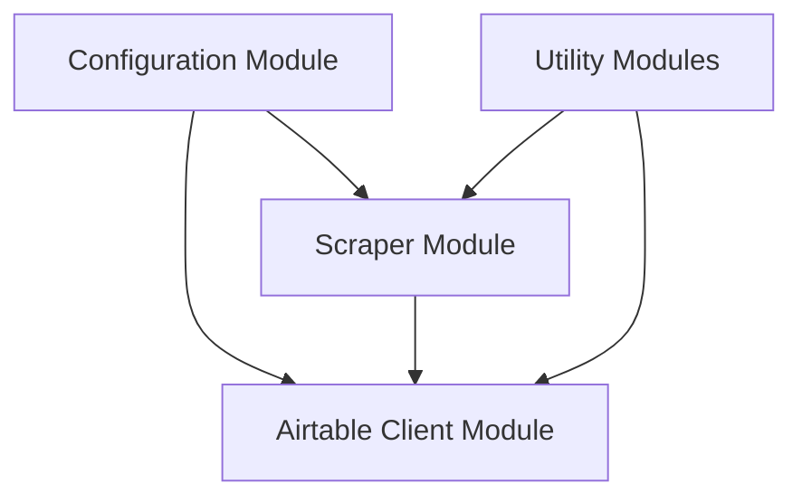
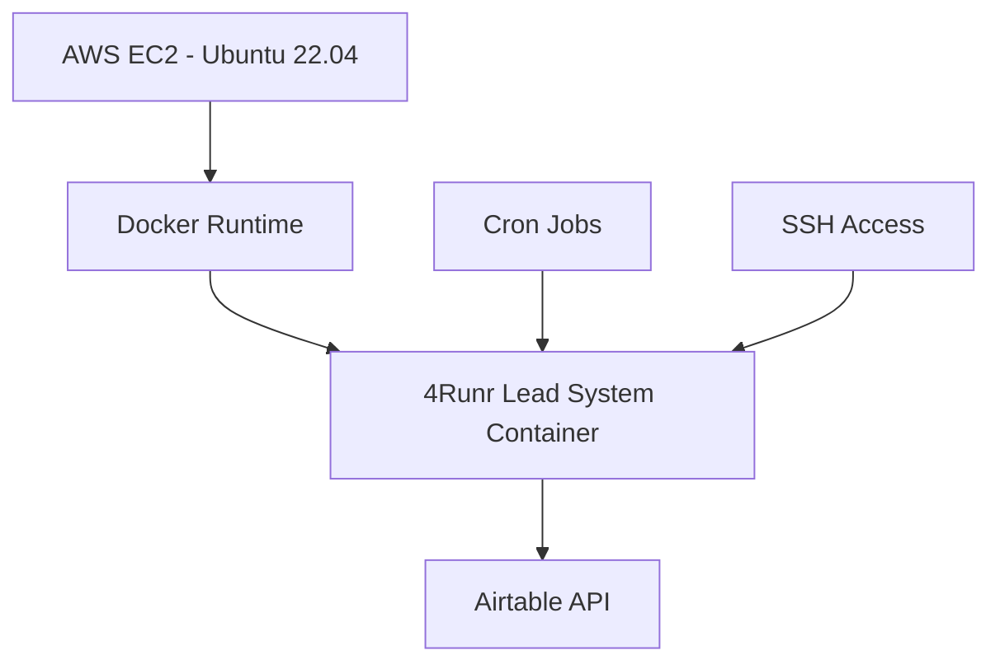

# Design Document: 4Runr AI Lead System

## Overview

The 4Runr AI Lead System is a backend-only lead generation and outreach system designed to automate the process of finding, enriching, and engaging with potential leads through LinkedIn and email. This design document outlines the architecture, components, and interfaces for Phase 1 of the system, which focuses on establishing the foundation with a clean backend structure, Airtable integration, and a simulated scraper agent.

## Architecture

The system follows a modular architecture with clear separation of concerns. Each component is designed to be independent and reusable, communicating through well-defined interfaces. The architecture consists of the following high-level components:

1. **Configuration Module**: Manages environment variables and configuration settings.
2. **Airtable Client Module**: Provides an abstraction layer for interacting with the Airtable API.
3. **Scraper Module**: Simulates the scraping of lead information from LinkedIn.
4. **Utility Modules**: Provides common functionality used across the system.



## Components and Interfaces

### 1. Configuration Module

The configuration module is responsible for loading and providing access to environment variables and other configuration settings.

**Interface:**
- `loadConfig()`: Loads configuration from .env file
- `getConfig(key)`: Returns the value of a specific configuration key

**Implementation Details:**
- Uses the `dotenv` package to load environment variables from a .env file
- Validates required configuration values on startup
- Provides a centralized access point for configuration values

### 2. Airtable Client Module

The Airtable Client Module provides an abstraction layer for interacting with the Airtable API, handling authentication, error handling, and data transformation.

**Interface:**
- `addLead(leadData)`: Adds a new lead to Airtable
- `getLeadsNeedingEnrichment()`: Retrieves leads marked as "Needs Enrichment"

**Implementation Details:**
- Uses the official Airtable JavaScript library
- Handles authentication using API key from configuration
- Implements error handling and retries for API calls
- Transforms data between application models and Airtable records

### 3. Scraper Module

The Scraper Module simulates the scraping of lead information from LinkedIn. In Phase 1, this module will generate mock data rather than performing actual scraping.

**Interface:**
- `scrapeLeads(count)`: Simulates scraping a specified number of leads
- `saveScrappedLeads(leads)`: Saves scrapped leads to Airtable

**Implementation Details:**
- Generates realistic mock data for leads
- Marks leads as needing enrichment
- Uses the Airtable Client Module to save leads

### 4. Utility Modules

Utility modules provide common functionality used across the system, such as logging, error handling, and data validation.

**Interface:**
- `logger`: Provides logging functionality
- `validator`: Provides data validation functions

**Implementation Details:**
- Uses the `chalk` package for colorized console output
- Implements structured logging with different log levels
- Provides validation functions for lead data

## Data Models

### Lead Model

The Lead model represents a potential business lead with the following properties:

```javascript
{
  id: String,              // Unique identifier (generated by Airtable)
  name: String,            // Full name of the lead
  linkedInUrl: String,     // LinkedIn profile URL
  company: String,         // Company name
  title: String,           // Job title
  email: String | null,    // Email address (null if not available)
  needsEnrichment: Boolean, // Flag indicating if the lead needs enrichment
  status: String,          // Status of the lead (e.g., "New", "Contacted", "Responded")
  createdAt: Date,         // Date when the lead was created
  updatedAt: Date          // Date when the lead was last updated
}
```

### Airtable Schema

The Airtable base will have a "Leads" table with the following fields:

- Name (Single line text)
- LinkedIn URL (URL)
- Company (Single line text)
- Title (Single line text)
- Email (Email - can be empty)
- Needs Enrichment (Checkbox)
- Status (Single select: New, Contacted, Responded, Not Interested, Converted)
- Created At (Date)
- Updated At (Date)

## Error Handling

The system implements a comprehensive error handling strategy:

1. **Validation Errors**: Thrown when input data does not meet validation requirements
2. **API Errors**: Thrown when there are issues with Airtable API calls
3. **Configuration Errors**: Thrown when required configuration is missing or invalid

All errors are logged with appropriate context and stack traces. Critical errors that prevent the system from functioning are thrown to the caller, while non-critical errors are logged and handled gracefully.

## Testing Strategy

The testing strategy for Phase 1 includes:

1. **Unit Tests**: Test individual functions and modules in isolation
2. **Integration Tests**: Test the interaction between modules, particularly the Airtable client
3. **Manual Testing**: Verify that the scraper correctly adds leads to Airtable

Key test cases include:
- Validating that the Airtable client correctly adds and retrieves leads
- Ensuring the scraper generates valid mock data
- Verifying that configuration is correctly loaded from environment variables

## Deployment and Execution

### Local Development

The system is designed to be run as CLI commands or scheduled tasks. The main entry points are:

1. `npm run scrape`: Runs the scraper to generate and save mock leads
2. `npm run list-leads`: Lists leads that need enrichment

These commands can be run manually or scheduled using cron jobs or similar scheduling tools.

### Production Deployment

The system will be deployed on AWS EC2 (Ubuntu 22.04 LTS) using Docker containers. The deployment architecture consists of:

1. **AWS EC2 Instance**: Ubuntu 22.04 LTS server hosting the Docker runtime
2. **Docker Container**: Encapsulates the Node.js application and its dependencies
3. **Cron Jobs**: Scheduled tasks for running the scraper at defined intervals
4. **SSH Access**: For manual triggering and management of the system



#### Docker Configuration

The Docker setup will use a multi-stage build process to optimize the image size:

1. **Build Stage**: Installs all dependencies and builds the application
2. **Production Stage**: Copies only the necessary files from the build stage

This approach ensures that the final Docker image is as small as possible, containing only what's needed to run the application in production.

#### Execution Methods

The system supports two methods of execution in production:

1. **Manual Execution via SSH**: Administrators can SSH into the EC2 instance and run Docker commands to execute the scraper or other functions
2. **Scheduled Execution via Cron**: Cron jobs can be set up to run the Docker container at scheduled intervals

Both methods use the same Docker container and command structure, ensuring consistency between manual and automated execution.

## Security Considerations

1. **API Key Management**: API keys and other sensitive information are stored in environment variables, not in code
2. **Input Validation**: All input data is validated before being processed
3. **Error Handling**: Errors are logged without exposing sensitive information

## Future Considerations (Phase 2)

While not part of Phase 1 implementation, the design accounts for future extensions:

1. **Enrichment Module**: Will add missing information to leads (e.g., email addresses)
2. **Engagement Module**: Will generate and send messages to leads
3. **LangGraph Integration**: Will incorporate AI logic for message generation and lead qualification

The modular architecture ensures that these components can be added without significant changes to the existing codebase.