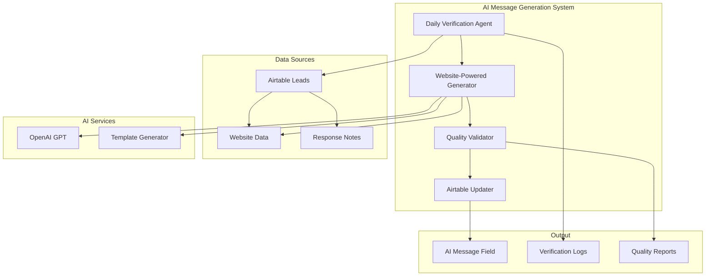

# Design Document

## Overview

The AI Message Generation Fix will enhance the existing AI message generation system to properly utilize website data for personalization and implement daily verification to ensure all eligible leads have AI messages. The system will integrate with the existing Airtable structure and leverage website scraping data (Company_Description, Website_Insights, Tone) to create highly personalized messages for manual sending.

The design builds upon the existing `AIMessageGenerator` class in `4runr-agents/shared/ai_message_generator.py` and the Campaign Brain system in `4runr-brain/process_empty_ai_message_leads.py`, enhancing them to properly handle website-based personalization and daily verification workflows.

## Architecture

### High-Level Architecture



### Core Components

1. **Daily Verification Agent**: Scans all leads to identify missing AI messages
2. **Website-Powered Generator**: Creates personalized messages using website data
3. **Quality Validator**: Ensures messages meet 4runr standards
4. **Airtable Updater**: Manages field updates with proper error handling

## Components and Interfaces

### Daily Verification Agent

Extends the existing verification system to handle website-based eligibility:

```python
class DailyVerificationAgent:
    def __init__(self):
        self.airtable_client = get_airtable_client()
        self.website_generator = WebsitePoweredGenerator()
        self.logger = get_logger('ai_message_verification')
    
    def run_daily_verification(self, limit: int = None) -> Dict[str, Any]:
        """Run daily verification to find leads needing AI messages"""
        
    def _should_generate_ai_message(self, lead: Dict[str, Any]) -> bool:
        """Determine if lead is eligible for AI message generation"""
        
    def _has_website_data(self, lead: Dict[str, Any]) -> bool:
        """Check if lead has sufficient website data for personalization"""
        
    def _check_response_notes_exclusion(self, lead: Dict[str, Any]) -> bool:
        """Check if response notes indicate no website available"""
```

### Website-Powered Generator

Enhanced generator that leverages website scraping data:

```python
class WebsitePoweredGenerator:
    def __init__(self):
        self.openai_client = OpenAI()
        self.template_engine = TemplateEngine()
        self.quality_validator = QualityValidator()
    
    def generate_website_personalized_message(self, lead: Dict[str, Any]) -> Dict[str, Any]:
        """Generate AI message using website data for personalization"""
        
    def _extract_website_context(self, lead: Dict[str, Any]) -> Dict[str, str]:
        """Extract relevant context from website data fields"""
        
    def _create_personalization_prompt(self, lead: Dict[str, Any], context: Dict[str, str]) -> str:
        """Create OpenAI prompt incorporating website insights"""
        
    def _apply_tone_adaptation(self, message: str, detected_tone: str) -> str:
        """Adapt message tone based on website tone analysis"""
```

### Quality Validator

Ensures generated messages meet 4runr standards:

```python
class QualityValidator:
    def __init__(self):
        self.brand_guidelines = self._load_brand_guidelines()
        self.quality_metrics = QualityMetrics()
    
    def validate_message_quality(self, message: str, lead_data: Dict[str, Any]) -> Dict[str, Any]:
        """Validate message against 4runr quality standards"""
        
    def _check_personalization_level(self, message: str, lead_data: Dict[str, Any]) -> float:
        """Score personalization quality based on lead-specific content"""
        
    def _validate_brand_compliance(self, message: str) -> List[str]:
        """Check message compliance with 4runr brand voice"""
        
    def _assess_human_readiness(self, message: str) -> bool:
        """Determine if message is ready for human review and sending"""
```

### Airtable Updater

Manages reliable updates to the AI Message field:

```python
class AirtableUpdater:
    def __init__(self):
        self.airtable_client = get_airtable_client()
        self.retry_handler = RetryHandler()
        self.logger = get_logger('airtable_updater')
    
    def update_ai_message_field(self, lead_id: str, message: str, metadata: Dict[str, Any]) -> bool:
        """Update AI Message field with retry logic and validation"""
        
    def _validate_field_update(self, lead_id: str, message: str) -> bool:
        """Validate message format and length for Airtable storage"""
        
    def _handle_update_failure(self, lead_id: str, error: Exception) -> None:
        """Handle and log update failures with appropriate retry strategy"""
```

## Data Models

### Enhanced Lead Data Structure

Extended lead data model incorporating website information:

```python
@dataclass
class EnhancedLeadData:
    # Core lead information
    lead_id: str
    name: str
    company: str
    title: str
    
    # Website data fields
    company_description: Optional[str]
    website_insights: Optional[str]
    top_services: Optional[str]
    detected_tone: Optional[str]
    
    # Response notes and exclusions
    response_notes: Optional[str]
    
    # AI message status
    ai_message: Optional[str]
    ai_message_generated_at: Optional[datetime]
    
    def has_website_data(self) -> bool:
        """Check if lead has sufficient website data"""
        
    def is_excluded_from_generation(self) -> bool:
        """Check if lead should be excluded based on response notes"""
```

### Website Context Extraction

Structured approach to extracting personalization context:

```python
@dataclass
class WebsiteContext:
    company_overview: str
    key_services: List[str]
    business_focus: str
    communication_tone: str
    unique_value_props: List[str]
    industry_indicators: List[str]
    
    @classmethod
    def from_lead_data(cls, lead: EnhancedLeadData) -> 'WebsiteContext':
        """Extract website context from lead's website data fields"""
```

### Message Generation Result

Comprehensive result structure for generated messages:

```python
@dataclass
class MessageGenerationResult:
    success: bool
    message: Optional[str]
    quality_score: float
    personalization_level: float
    website_data_used: List[str]
    generation_method: str
    tone_adaptation: str
    brand_compliance: bool
    ready_for_human_review: bool
    error_details: Optional[str]
    metadata: Dict[str, Any]
```

## Error Handling

### Website Data Validation

Robust validation of website data availability and quality:

```python
class WebsiteDataValidator:
    def validate_website_data_sufficiency(self, lead: EnhancedLeadData) -> ValidationResult:
        """Validate if website data is sufficient for personalization"""
        
    def _check_company_description_quality(self, description: str) -> bool:
        """Validate company description has meaningful content"""
        
    def _assess_website_insights_depth(self, insights: str) -> float:
        """Score the depth and usefulness of website insights"""
```

### Generation Failure Handling

Comprehensive error handling for message generation failures:

1. **OpenAI API Failures**: Retry with exponential backoff, fallback to template-based generation
2. **Website Data Issues**: Graceful degradation to basic personalization
3. **Quality Validation Failures**: Flag for manual review with detailed feedback
4. **Airtable Update Failures**: Queue for retry with persistent storage

### Response Notes Parsing

Intelligent parsing of response notes to identify exclusions:

```python
class ResponseNotesParser:
    def __init__(self):
        self.exclusion_patterns = [
            r"no website",
            r"website not available",
            r"site down",
            r"under construction",
            r"coming soon"
        ]
    
    def should_exclude_from_generation(self, response_notes: str) -> bool:
        """Parse response notes to determine if lead should be excluded"""
```

## Testing Strategy

### Unit Testing

- **Website Context Extraction**: Test extraction from various website data formats
- **Message Personalization**: Validate personalization quality with different data inputs
- **Quality Validation**: Test brand compliance and human-readiness scoring
- **Response Notes Parsing**: Test exclusion pattern matching

### Integration Testing

- **End-to-End Generation**: Test complete workflow from lead identification to message storage
- **Airtable Integration**: Validate field updates and error handling
- **Daily Verification**: Test batch processing and statistics generation
- **Quality Assurance**: Test message quality across different lead types

### Data Quality Testing

- **Website Data Variations**: Test with different quality levels of website data
- **Edge Cases**: Test with missing fields, malformed data, and API failures
- **Performance Testing**: Validate processing speed with large lead batches
- **Compliance Testing**: Ensure all generated messages meet brand standards

## Performance Optimization

### Batch Processing

Efficient processing of large lead volumes:

```python
class BatchProcessor:
    def __init__(self, batch_size: int = 50):
        self.batch_size = batch_size
        self.parallel_workers = 5
    
    def process_leads_in_batches(self, leads: List[EnhancedLeadData]) -> BatchResult:
        """Process leads in optimized batches with parallel execution"""
```

### Caching Strategy

- **Website Data Caching**: Cache processed website context to avoid recomputation
- **Template Caching**: Cache frequently used message templates
- **Quality Validation Caching**: Cache validation results for similar content
- **OpenAI Response Caching**: Cache similar personalization requests

### Rate Limiting

- **OpenAI API**: Respect rate limits with intelligent queuing
- **Airtable API**: Batch updates and respect quotas
- **Parallel Processing**: Optimize concurrent operations without overwhelming APIs

## Security and Compliance

### Data Privacy

- **PII Handling**: Secure processing of personal information in messages
- **Data Retention**: Configurable retention policies for generated content
- **Access Control**: Restricted access to AI message generation functions
- **Audit Logging**: Comprehensive logging of all generation activities

### Quality Assurance

- **Brand Compliance**: Automated checking against 4runr brand guidelines
- **Content Appropriateness**: Validation of professional tone and content
- **Personalization Accuracy**: Verification that personalization is relevant and accurate
- **Human Review Readiness**: Ensure messages are ready for human review and approval

## Monitoring and Observability

### Generation Metrics

- **Success Rates**: Track successful message generation by data quality
- **Quality Scores**: Monitor average quality scores and trends
- **Personalization Effectiveness**: Measure personalization depth and relevance
- **Processing Performance**: Track generation speed and resource usage

### Daily Verification Reporting

- **Coverage Statistics**: Report on leads processed vs. leads needing messages
- **Exclusion Analysis**: Track leads excluded due to missing website data
- **Quality Distribution**: Monitor quality score distribution across generated messages
- **Error Analysis**: Detailed reporting on generation failures and causes