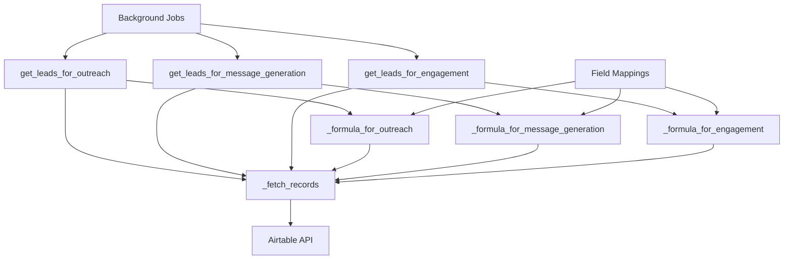

# Design Document

## Overview

The Airtable Fetch Methods Fix will modify the existing ConfigurableAirtableClient class to add three new public methods with the expected signatures that the background jobs require. The design maintains backward compatibility with existing methods while adding the new interface that accepts `limit` parameters. The solution uses a shared internal helper method to avoid code duplication and implements defensive formula building to handle missing or invalid field mappings gracefully.

## Architecture

The solution follows a layered approach:

1. **Public API Layer**: Three new public methods that match the expected signatures
2. **Internal Helper Layer**: Shared `_fetch_records` method that handles the actual Airtable API calls
3. **Formula Builder Layer**: Defensive formula builders that handle missing field mappings
4. **Configuration Layer**: Existing field mapping system from environment variables



## Components and Interfaces

### Public Methods

The three new public methods will have identical signatures and behavior patterns:

```python
def get_leads_for_outreach(self, limit: Optional[int] = None) -> List[Dict[str, Any]]:
    """Leads that are candidates for website scraping / enrichment."""
    
def get_leads_for_message_generation(self, limit: Optional[int] = None) -> List[Dict[str, Any]]:
    """Leads that need an AI message generated."""
    
def get_leads_for_engagement(self, limit: Optional[int] = None) -> List[Dict[str, Any]]:
    """Leads ready to be engaged (e.g., have an email + a generated message)."""
```

### Internal Helper Method

A single shared method handles all Airtable API interactions:

```python
def _fetch_records(self, *, formula: Optional[str], limit: Optional[int]) -> List[Dict[str, Any]]:
    """
    Shared helper for fetching records from Airtable.
    
    Args:
        formula: Optional Airtable formula for filtering
        limit: Optional limit on number of records (uses default if None)
        
    Returns:
        List of record dictionaries
    """
```

### Formula Builders

Three defensive formula builders create appropriate filters:

```python
def _formula_for_outreach(self) -> Optional[str]:
    """Build formula for leads needing website scraping."""
    
def _formula_for_message_generation(self) -> Optional[str]:
    """Build formula for leads needing message generation."""
    
def _formula_for_engagement(self) -> Optional[str]:
    """Build formula for leads ready for engagement."""
```

## Data Models

### Field Mapping Structure

The existing field mapping system will be used:

```python
self.fields = {
    'website': self.field_website,
    'company_description': self.field_company_description,
    'email': self.field_email,
    'company_name': self.field_company_name,
    'ai_message': self.field_custom_message,  # or other message field variants
    'contacted': self.field_engagement_status  # or similar tracking field
}
```

### Record Format

All methods return the same record format:

```python
{
    'id': 'rec123456789',
    'Website': 'https://example.com',
    'Email': 'contact@example.com',
    'Company Name': 'Example Corp',
    # ... other fields from Airtable
}
```

## Error Handling

### Defensive Formula Building

Formula builders implement multiple fallback strategies:

1. **Primary Strategy**: Build optimal formula using all available field mappings
2. **Fallback Strategy**: Build simpler formula with fewer requirements
3. **Final Fallback**: Return None to fetch all records without filtering

### API Error Handling

The `_fetch_records` method implements comprehensive error handling:

1. **Connection Errors**: Log error and return empty list
2. **Formula Errors**: Log available fields for debugging and return empty list
3. **Rate Limiting**: Handled by pyairtable library
4. **Invalid Field Names**: Logged with available field names for troubleshooting

### Logging Strategy

All error conditions are logged with structured data:

```python
self.logger.error("Airtable fetch failed", extra={
    "error": str(e),
    "kwargs": kwargs,
    "available_fields": self._get_available_field_names()
})
```

## Testing Strategy

### Unit Tests

1. **Method Signature Tests**: Verify all three methods accept `limit` parameter
2. **Formula Builder Tests**: Test defensive behavior with missing field mappings
3. **Helper Method Tests**: Verify `_fetch_records` handles various input combinations
4. **Error Handling Tests**: Verify graceful degradation when Airtable API fails

### Integration Tests

1. **End-to-End Pipeline Tests**: Verify background jobs can call methods without errors
2. **Airtable API Tests**: Test actual API calls with various formula combinations
3. **Field Mapping Tests**: Test with different environment variable configurations
4. **Healthcheck Tests**: Verify application boots and stays healthy

### Backward Compatibility Tests

1. **Existing Method Tests**: Verify existing methods continue to work unchanged
2. **Global Client Tests**: Verify `get_configurable_airtable_client()` still works
3. **Import Tests**: Verify all existing imports continue to work

## Implementation Details

### Default Limit Handling

The system will use a configurable default limit:

```python
max_records = int(limit) if limit else int(getattr(self, "default_limit", 10))
```

### Formula Building Logic

Each formula builder follows this pattern:

1. Check if required field mappings exist
2. Build primary formula with optimal filtering
3. Return None if field mappings are missing (triggers no-filter fallback)
4. Use defensive field name checking to avoid invalid formulas

### Field Mapping Access

Formula builders access field mappings through a consistent pattern:

```python
website = self.fields.get("website")  # Returns None if not configured
email = self.fields.get("email")      # Safe access pattern
```

### Airtable Formula Syntax

All formulas use proper Airtable syntax:

```python
# Single condition
f"NOT({{{field_name}}} = '')"

# Multiple conditions with AND
f"AND(NOT({{{email}}} = ''), NOT({{{message}}} = ''))"

# Multiple conditions with OR
f"OR({{{field}}} = '', NOT({{{field}}}))"
```

This design ensures the background jobs can successfully call the expected methods while maintaining all existing functionality and providing robust error handling for production use.