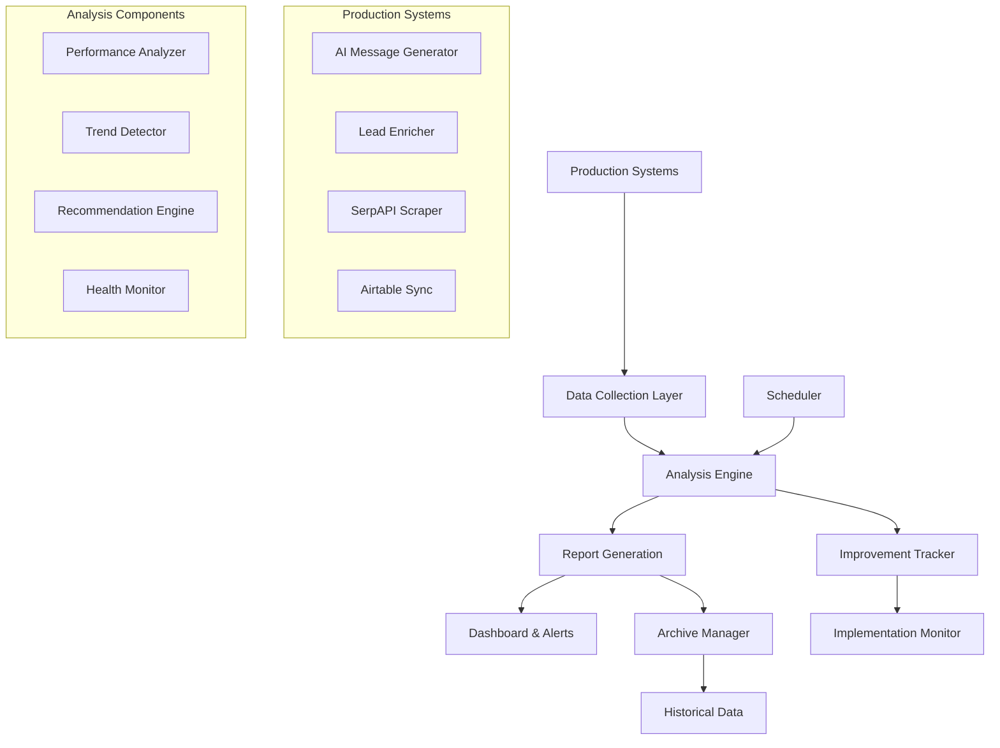

# Automated AI Improvement System - Design Document

## Overview

The Automated AI Improvement System is a comprehensive solution that continuously monitors, analyzes, and optimizes the 4Runr AI lead generation system. It operates as a background service that automatically collects production data, performs weekly analysis, generates actionable insights, and tracks improvement implementations.

## Architecture

### High-Level Architecture



### System Components

#### 1. Data Collection Layer
- **Production Logger Integration**: Seamlessly captures all AI decisions
- **Log Aggregator**: Consolidates logs from multiple sources
- **Data Validator**: Ensures log completeness and quality
- **Real-time Buffer**: Handles high-volume logging without performance impact

#### 2. Analysis Engine
- **Performance Analyzer**: Calculates success rates, timing metrics, quality scores
- **Trend Detector**: Identifies patterns and changes over time
- **Recommendation Engine**: Generates prioritized improvement suggestions
- **Health Monitor**: Tracks system health and triggers alerts

#### 3. Scheduler & Automation
- **Weekly Scheduler**: Runs analysis every Sunday at 9:00 AM
- **Retry Logic**: Handles failures with exponential backoff
- **Dependency Manager**: Ensures all required data is available
- **Resource Monitor**: Prevents analysis during high system load

#### 4. Report Management
- **Report Generator**: Creates both technical and executive summaries
- **Archive Manager**: Organizes reports by date and manages retention
- **Dashboard Builder**: Generates interactive web-based dashboards
- **Export Engine**: Supports multiple output formats

## Components and Interfaces

### Core Classes

#### AIAnalysisEngine
```python
class AIAnalysisEngine:
    def __init__(self, config: AnalysisConfig)
    def analyze_weekly_performance(self, days_back: int = 7) -> AnalysisResults
    def generate_recommendations(self, results: AnalysisResults) -> List[Recommendation]
    def track_implementation_impact(self, recommendation_id: str) -> ImpactMetrics
    def calculate_roi(self, before_metrics: Dict, after_metrics: Dict) -> ROIAnalysis
```

#### ReportManager
```python
class ReportManager:
    def __init__(self, output_directory: Path)
    def generate_executive_summary(self, analysis: AnalysisResults) -> ExecutiveReport
    def generate_technical_report(self, analysis: AnalysisResults) -> TechnicalReport
    def create_dashboard(self, historical_data: List[AnalysisResults]) -> Dashboard
    def archive_old_reports(self, retention_days: int = 90) -> None
```

#### ImprovementTracker
```python
class ImprovementTracker:
    def __init__(self, tracking_database: Path)
    def create_improvement_ticket(self, recommendation: Recommendation) -> str
    def mark_implemented(self, ticket_id: str, implementation_details: Dict) -> None
    def measure_impact(self, ticket_id: str, measurement_period: int = 14) -> ImpactReport
    def calculate_cumulative_roi(self) -> ROISummary
```

#### HealthMonitor
```python
class HealthMonitor:
    def __init__(self, alert_thresholds: Dict)
    def check_system_health(self, current_metrics: Dict) -> HealthStatus
    def trigger_alerts(self, health_status: HealthStatus) -> None
    def escalate_critical_issues(self, consecutive_failures: int) -> None
    def generate_health_dashboard(self) -> HealthDashboard
```

### Data Models

#### AnalysisResults
```python
@dataclass
class AnalysisResults:
    analysis_period: DateRange
    ai_message_performance: MessageAnalysis
    enrichment_performance: EnrichmentAnalysis
    scraping_performance: ScrapingAnalysis
    airtable_performance: AirtableAnalysis
    overall_health: HealthStatus
    trends: List[Trend]
    alerts: List[Alert]
```

#### Recommendation
```python
@dataclass
class Recommendation:
    id: str
    category: str  # 'message_generation', 'enrichment', 'scraping', 'airtable'
    priority: Priority  # HIGH, MEDIUM, LOW
    title: str
    description: str
    action_items: List[ActionItem]
    estimated_impact: ImpactEstimate
    implementation_difficulty: Difficulty
    created_at: datetime
    status: RecommendationStatus
```

#### ImpactMetrics
```python
@dataclass
class ImpactMetrics:
    recommendation_id: str
    before_metrics: Dict[str, float]
    after_metrics: Dict[str, float]
    improvement_percentage: Dict[str, float]
    roi_calculation: float
    measurement_confidence: float
    measurement_period_days: int
```

## Data Models

### Production Log Schema
```json
{
  "log_type": "campaign_generation|enrichment_decision|website_analysis|airtable_operation",
  "session_id": "unique_session_identifier",
  "timestamp": "ISO_8601_timestamp",
  "lead_identifier": {
    "name": "lead_name",
    "company": "company_name",
    "industry": "industry_classification"
  },
  "input_data": {
    "context_specific_input_fields": "values"
  },
  "output_data": {
    "context_specific_output_fields": "values"
  },
  "decision_reasoning": {
    "method_used": "algorithm_or_approach",
    "confidence_level": "high|medium|low",
    "processing_time": "seconds",
    "success": "boolean"
  },
  "training_labels": {
    "quality_score": "0-100",
    "success_indicator": "boolean",
    "improvement_potential": "high|medium|low"
  }
}
```

### Analysis Report Schema
```json
{
  "report_metadata": {
    "report_id": "unique_identifier",
    "generated_at": "timestamp",
    "analysis_period": {
      "start_date": "date",
      "end_date": "date",
      "days_analyzed": "integer"
    },
    "report_type": "weekly|monthly|quarterly"
  },
  "performance_metrics": {
    "ai_message_generation": {
      "total_messages": "integer",
      "approval_rate": "percentage",
      "average_quality_score": "0-100",
      "template_effectiveness": "object"
    },
    "lead_enrichment": {
      "total_enrichments": "integer",
      "success_rate": "percentage",
      "average_processing_time": "seconds",
      "method_effectiveness": "object"
    }
  },
  "trends": [
    {
      "metric_name": "string",
      "trend_direction": "improving|declining|stable",
      "change_percentage": "float",
      "significance": "high|medium|low"
    }
  ],
  "recommendations": [
    {
      "id": "unique_identifier",
      "priority": "HIGH|MEDIUM|LOW",
      "category": "string",
      "title": "string",
      "description": "string",
      "action_items": ["array_of_strings"],
      "estimated_impact": {
        "metric_improvements": "object",
        "roi_estimate": "float",
        "implementation_effort": "hours"
      }
    }
  ],
  "system_health": {
    "overall_status": "excellent|good|needs_attention|critical",
    "component_health": "object",
    "alerts": ["array_of_alert_objects"]
  }
}
```

## Error Handling

### Failure Scenarios and Recovery

#### 1. Analysis Execution Failures
- **Scenario**: Weekly analysis fails due to corrupted log files
- **Detection**: Exception handling in analysis engine
- **Recovery**: Skip corrupted files, log warning, continue with available data
- **Notification**: Include data quality warning in report

#### 2. Scheduler Failures
- **Scenario**: Scheduled analysis doesn't run due to system downtime
- **Detection**: Heartbeat monitoring and missed execution detection
- **Recovery**: Automatic retry with exponential backoff (1 hour, 4 hours, 24 hours)
- **Notification**: Alert system administrator after 3 failed attempts

#### 3. Report Generation Failures
- **Scenario**: Report generation fails due to insufficient disk space
- **Detection**: File system monitoring and exception handling
- **Recovery**: Clean up old reports, retry generation
- **Notification**: Include storage warning in next successful report

#### 4. Data Collection Interruptions
- **Scenario**: Production logging stops working
- **Detection**: Monitor log file timestamps and entry counts
- **Recovery**: Restart logging service, validate data integrity
- **Notification**: Alert immediately as this affects all analysis

### Error Recovery Strategies

#### Graceful Degradation
- Continue analysis with partial data when some components fail
- Generate reports with data quality indicators
- Provide recommendations based on available information

#### Self-Healing Mechanisms
- Automatic retry logic with intelligent backoff
- Automatic cleanup of corrupted files
- Dynamic threshold adjustment based on data availability

#### Monitoring and Alerting
- Real-time health checks for all system components
- Automated alerts for critical failures
- Dashboard indicators for system status

## Testing Strategy

### Unit Testing
- **Analysis Engine**: Test metric calculations, trend detection, recommendation generation
- **Report Manager**: Test report formatting, archiving, dashboard generation
- **Improvement Tracker**: Test ticket creation, impact measurement, ROI calculation
- **Health Monitor**: Test threshold detection, alert triggering, escalation logic

### Integration Testing
- **End-to-End Analysis**: Test complete weekly analysis workflow
- **Data Pipeline**: Test log collection through report generation
- **Scheduler Integration**: Test automated execution and retry logic
- **Dashboard Integration**: Test real-time data updates and user interactions

### Performance Testing
- **Large Dataset Handling**: Test analysis with 10,000+ log entries
- **Concurrent Access**: Test multiple users accessing dashboards simultaneously
- **Memory Usage**: Ensure analysis completes within memory constraints
- **Processing Time**: Verify analysis completes within 5-minute target

### Reliability Testing
- **Failure Recovery**: Test system behavior during various failure scenarios
- **Data Corruption**: Test handling of corrupted or incomplete log files
- **Resource Exhaustion**: Test behavior when disk space or memory is limited
- **Long-term Stability**: Test continuous operation over extended periods

### User Acceptance Testing
- **Executive Dashboard**: Test usability for business stakeholders
- **Technical Reports**: Test completeness for technical team members
- **Recommendation Clarity**: Test actionability of improvement suggestions
- **Trend Visualization**: Test clarity of performance trend displays

## Implementation Phases

### Phase 1: Core Analysis Engine (Week 1-2)
- Implement basic weekly analysis functionality
- Create fundamental report generation
- Set up automated scheduling
- Basic error handling and logging

### Phase 2: Advanced Analytics (Week 3-4)
- Implement trend detection algorithms
- Add recommendation engine
- Create improvement tracking system
- Enhanced error recovery mechanisms

### Phase 3: Dashboard and Visualization (Week 5-6)
- Build interactive web dashboard
- Implement real-time health monitoring
- Add executive summary generation
- Create export functionality

### Phase 4: Optimization and Scaling (Week 7-8)
- Performance optimization for large datasets
- Advanced caching mechanisms
- Automated archiving and cleanup
- Comprehensive testing and validation

This design provides a robust, scalable, and maintainable system that will automatically improve your AI performance week over week without manual intervention.