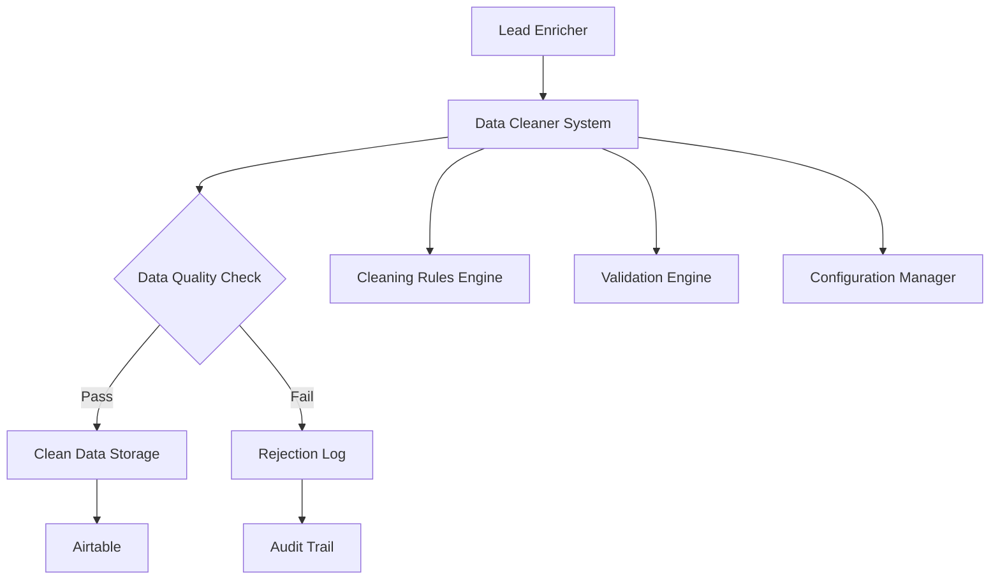

# Data Cleaner System Design Document

## Overview

The Data Cleaner System is a critical middleware component that sits between the lead enrichment pipeline and Airtable storage. It intercepts all scraped data, applies intelligent cleaning rules, validates data quality, and ensures only professional-grade information reaches the database. The system is designed to achieve 110% data quality by combining automated cleaning with configurable validation rules.

## Architecture

### High-Level Architecture



### System Integration Points

1. **Input Interface**: Receives raw scraped data from enrichers (Google Enricher, Simple Enricher, etc.)
2. **Processing Pipeline**: Applies cleaning rules and validation checks
3. **Output Interface**: Forwards clean data to Airtable or logs rejections
4. **Configuration Interface**: Allows rule updates without code changes
5. **Audit Interface**: Provides comprehensive logging and metrics

## Components and Interfaces

### 1. DataCleaner (Main Class)

**Location**: `4runr-outreach-system/shared/data_cleaner.py`

**Responsibilities**:
- Orchestrate the cleaning and validation pipeline
- Manage configuration and rule loading
- Provide audit trail and metrics

**Key Methods**:
```python
class DataCleaner:
    def __init__(self, config_path: str = None)
    def clean_and_validate(self, raw_data: Dict[str, Any], lead_context: Dict[str, Any]) -> CleaningResult
    def get_cleaning_stats(self) -> Dict[str, Any]
    def update_rules(self, new_rules: Dict[str, Any]) -> bool
```

### 2. CleaningRulesEngine

**Responsibilities**:
- Apply text cleaning rules to remove artifacts
- Handle HTML fragment cleanup
- Normalize company names and websites
- Remove Google search artifacts

**Key Methods**:
```python
class CleaningRulesEngine:
    def clean_company_name(self, company: str) -> str
    def clean_website_url(self, website: str) -> str
    def remove_search_artifacts(self, text: str) -> str
    def remove_html_fragments(self, text: str) -> str
    def normalize_text(self, text: str) -> str
```

### 3. ValidationEngine

**Responsibilities**:
- Validate data quality against configurable criteria
- Check for professional formatting standards
- Verify data completeness and accuracy
- Handle edge cases gracefully

**Key Methods**:
```python
class ValidationEngine:
    def validate_company_name(self, company: str, context: Dict[str, Any]) -> ValidationResult
    def validate_website_url(self, website: str, context: Dict[str, Any]) -> ValidationResult
    def validate_data_completeness(self, data: Dict[str, Any]) -> ValidationResult
    def validate_professional_standards(self, data: Dict[str, Any]) -> ValidationResult
```

### 4. ConfigurationManager

**Responsibilities**:
- Load and manage cleaning rules from configuration files
- Handle rule updates and validation
- Provide rule versioning and rollback capabilities

**Key Methods**:
```python
class ConfigurationManager:
    def load_rules(self, config_path: str) -> Dict[str, Any]
    def validate_config(self, config: Dict[str, Any]) -> bool
    def update_rules(self, new_rules: Dict[str, Any]) -> bool
    def get_rule_version(self) -> str
```

### 5. AuditLogger

**Responsibilities**:
- Log all cleaning and validation decisions
- Track metrics and performance data
- Provide audit trail for compliance
- Generate quality reports

**Key Methods**:
```python
class AuditLogger:
    def log_cleaning_action(self, action: str, before: str, after: str, rule: str)
    def log_validation_result(self, field: str, value: str, result: ValidationResult)
    def log_rejection(self, data: Dict[str, Any], reasons: List[str])
    def generate_quality_report(self, time_period: str) -> Dict[str, Any]
```

## Data Models

### CleaningResult

```python
@dataclass
class CleaningResult:
    success: bool
    cleaned_data: Dict[str, Any]
    original_data: Dict[str, Any]
    cleaning_actions: List[CleaningAction]
    validation_results: List[ValidationResult]
    rejection_reasons: List[str]
    confidence_score: float
    processing_time: float
```

### ValidationResult

```python
@dataclass
class ValidationResult:
    field_name: str
    is_valid: bool
    confidence_score: float
    validation_rule: str
    error_message: str
    suggested_fix: str
```

### CleaningAction

```python
@dataclass
class CleaningAction:
    rule_name: str
    field_name: str
    original_value: str
    cleaned_value: str
    confidence_score: float
    applied_at: datetime
```

## Error Handling

### Graceful Degradation Strategy

1. **Rule Failure**: If a cleaning rule fails, log the error and continue with remaining rules
2. **Validation Failure**: If validation fails, provide detailed feedback and rejection reasons
3. **System Failure**: If the entire cleaner fails, fallback to original enricher behavior with error logging
4. **Configuration Errors**: Validate configuration on startup and provide clear error messages

### Error Categories

1. **Recoverable Errors**: Rule failures, minor validation issues
2. **Non-Recoverable Errors**: Invalid configuration, system failures
3. **Data Quality Errors**: Garbage data detection, professional standards violations

## Testing Strategy

### Unit Testing

1. **Cleaning Rules Testing**: Test each cleaning rule with known good/bad data
2. **Validation Logic Testing**: Test validation criteria with edge cases
3. **Configuration Testing**: Test rule loading and validation
4. **Integration Testing**: Test with real enricher data

### Test Data Categories

1. **Known Good Data**: Professional company names and websites
2. **Known Bad Data**: Google search artifacts, HTML fragments
3. **Edge Cases**: International companies, unusual but valid formats
4. **Malicious Data**: Injection attempts, malformed input

### Performance Testing

1. **Throughput Testing**: Process large batches of leads
2. **Memory Usage**: Monitor memory consumption during processing
3. **Response Time**: Ensure cleaning doesn't significantly slow enrichment

## Configuration Schema

### Cleaning Rules Configuration

```yaml
cleaning_rules:
  company_name:
    remove_patterns:
      - "google"
      - "search results"
      - "linkedin"
      - "Some results may have been"
    normalize_patterns:
      - pattern: "\\s+Inc\\.?$"
        replacement: " Inc"
      - pattern: "\\s+LLC\\.?$"
        replacement: " LLC"
    min_length: 2
    max_length: 100
    
  website_url:
    remove_patterns:
      - "google.com"
      - "linkedin.com"
      - "facebook.com"
    required_protocols:
      - "http://"
      - "https://"
    domain_validation: true
    
  search_artifacts:
    remove_patterns:
      - "Some results may have been delisted consistent with local laws"
      - "Learn more Next"
      - "About [0-9,]+ results"
      - "Search instead for"
```

### Validation Rules Configuration

```yaml
validation_rules:
  company_name:
    min_confidence: 0.7
    required_patterns:
      - "^[A-Za-z0-9\\s&,.\\'\\-]+$"
    forbidden_patterns:
      - "google"
      - "search"
      - "results"
    professional_indicators:
      - "Inc"
      - "LLC"
      - "Corp"
      - "Ltd"
      
  website_url:
    min_confidence: 0.8
    required_format: "^https?://[a-zA-Z0-9.-]+\\.[a-zA-Z]{2,}.*$"
    forbidden_domains:
      - "google.com"
      - "linkedin.com"
      - "facebook.com"
    ssl_preferred: true
```

## Integration with Existing System

### Enricher Integration Points

1. **Google Enricher**: Intercept data before `airtable_client.update_lead_fields()`
2. **Simple Enricher**: Integrate into the data processing pipeline
3. **Future Enrichers**: Provide standard interface for all enrichers

### Integration Pattern

```python
# Before (in enricher):
airtable_fields = {'Company': company, 'Website': website}
success = self.airtable_client.update_lead_fields(lead_id, airtable_fields)

# After (with data cleaner):
from shared.data_cleaner import DataCleaner

cleaner = DataCleaner()
raw_data = {'Company': company, 'Website': website}
lead_context = {'id': lead_id, 'Full Name': full_name}

cleaning_result = cleaner.clean_and_validate(raw_data, lead_context)

if cleaning_result.success:
    success = self.airtable_client.update_lead_fields(lead_id, cleaning_result.cleaned_data)
else:
    self.logger.log_rejection(lead_id, cleaning_result.rejection_reasons)
```

## Performance Considerations

### Optimization Strategies

1. **Rule Caching**: Cache compiled regex patterns and validation rules
2. **Batch Processing**: Process multiple fields simultaneously
3. **Lazy Loading**: Load configuration only when needed
4. **Memory Management**: Clean up temporary objects after processing

### Scalability

1. **Horizontal Scaling**: Support multiple cleaner instances
2. **Configuration Distribution**: Centralized rule management
3. **Metrics Aggregation**: Collect metrics from multiple instances

## Security Considerations

### Input Validation

1. **Injection Prevention**: Sanitize all input data
2. **Size Limits**: Enforce maximum data size limits
3. **Type Validation**: Ensure data types match expectations

### Configuration Security

1. **Rule Validation**: Validate all configuration changes
2. **Access Control**: Restrict configuration update permissions
3. **Audit Trail**: Log all configuration changes

## Monitoring and Metrics

### Key Performance Indicators

1. **Data Quality Score**: Percentage of data passing validation
2. **Cleaning Effectiveness**: Before/after quality comparison
3. **Processing Speed**: Average time per lead processed
4. **Rule Effectiveness**: Success rate per cleaning rule

### Alerting Thresholds

1. **Quality Degradation**: Alert if quality score drops below 90%
2. **Processing Delays**: Alert if processing time exceeds 5 seconds per lead
3. **High Rejection Rate**: Alert if rejection rate exceeds 20%
4. **System Errors**: Alert on any system-level failures

## Deployment Strategy

### Rollout Plan

1. **Phase 1**: Deploy with logging only (no data modification)
2. **Phase 2**: Enable cleaning rules with manual review
3. **Phase 3**: Enable full automation with monitoring
4. **Phase 4**: Optimize based on production metrics

### Rollback Strategy

1. **Configuration Rollback**: Revert to previous rule set
2. **Feature Toggle**: Disable cleaner and fallback to original behavior
3. **Data Recovery**: Restore from audit logs if needed