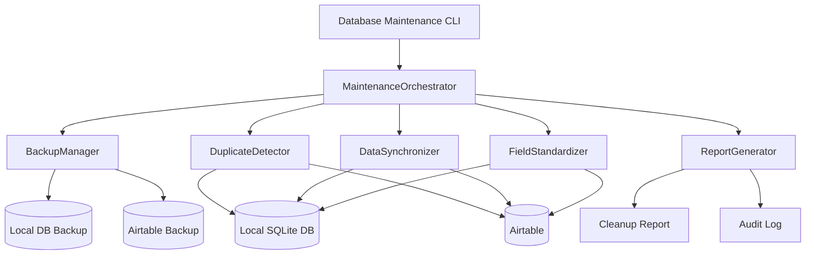

# Database Maintenance System Design Document

## Overview

The Database Maintenance System is a comprehensive cleanup and synchronization tool that performs full maintenance operations across both the local SQLite database and Airtable. This system provides a "reset" capability to bring both systems to a clean, consistent state by removing duplicates, standardizing field values, and ensuring data synchronization. It's designed to handle large datasets efficiently while providing comprehensive backup and recovery capabilities.

## Architecture

### High-Level Architecture



### System Integration Points

1. **Local Database Interface**: Uses existing `LeadDatabase` and `DatabaseConnection` classes
2. **Airtable Interface**: Uses existing `ConfigurableAirtableClient` for API operations
3. **Backup System**: Integrates with existing backup infrastructure
4. **Configuration System**: Uses YAML configuration files for rules and policies
5. **Logging System**: Comprehensive audit trail and operation logging

## Components and Interfaces

### 1. MaintenanceOrchestrator (Main Class)

**Location**: `4runr-outreach-system/shared/database_maintenance.py`

**Responsibilities**:
- Orchestrate the complete maintenance workflow
- Coordinate backup, cleanup, and synchronization operations
- Manage configuration and rule loading
- Provide progress tracking and status updates

**Key Methods**:
```python
class MaintenanceOrchestrator:
    def __init__(self, config_path: str = None)
    def run_full_maintenance(self, options: MaintenanceOptions) -> MaintenanceResult
    def run_duplicate_cleanup(self) -> CleanupResult
    def run_field_standardization(self, field_rules: Dict[str, Any]) -> StandardizationResult
    def run_data_synchronization(self) -> SyncResult
    def get_maintenance_status(self) -> Dict[str, Any]
```

### 2. BackupManager

**Responsibilities**:
- Create comprehensive backups before any operations
- Manage backup retention and storage
- Provide rollback capabilities
- Verify backup integrity

**Key Methods**:
```python
class BackupManager:
    def create_full_backup(self) -> BackupResult
    def create_database_backup(self) -> str
    def create_airtable_backup(self) -> str
    def verify_backup_integrity(self, backup_path: str) -> bool
    def restore_from_backup(self, backup_path: str) -> bool
    def cleanup_old_backups(self, retention_days: int = 30) -> int
```

### 3. DuplicateDetector

**Responsibilities**:
- Identify duplicate records across both systems
- Apply configurable matching criteria
- Resolve conflicts using precedence rules
- Merge or remove duplicates safely

**Key Methods**:
```python
class DuplicateDetector:
    def find_database_duplicates(self, matching_fields: List[str]) -> List[DuplicateGroup]
    def find_airtable_duplicates(self, matching_fields: List[str]) -> List[DuplicateGroup]
    def find_cross_system_duplicates(self) -> List[CrossSystemDuplicate]
    def resolve_duplicates(self, duplicates: List[DuplicateGroup], strategy: str) -> ResolutionResult
    def merge_duplicate_records(self, primary_record: Dict, duplicate_records: List[Dict]) -> Dict
```

### 4. DataSynchronizer

**Responsibilities**:
- Synchronize data between local database and Airtable
- Resolve data conflicts using configurable strategies
- Ensure bidirectional consistency
- Handle large dataset synchronization efficiently

**Key Methods**:
```python
class DataSynchronizer:
    def sync_database_to_airtable(self, batch_size: int = 50) -> SyncResult
    def sync_airtable_to_database(self, batch_size: int = 50) -> SyncResult
    def find_data_conflicts(self) -> List[DataConflict]
    def resolve_conflicts(self, conflicts: List[DataConflict], strategy: str) -> ConflictResolution
    def validate_sync_integrity(self) -> ValidationResult
```

### 5. FieldStandardizer

**Responsibilities**:
- Standardize field values across both systems
- Apply consistent formatting rules
- Set default values for empty fields
- Handle engagement status standardization

**Key Methods**:
```python
class FieldStandardizer:
    def standardize_engagement_status(self, default_status: str = "auto_send") -> StandardizationResult
    def standardize_company_names(self) -> StandardizationResult
    def standardize_website_urls(self) -> StandardizationResult
    def standardize_email_formats(self) -> StandardizationResult
    def apply_field_defaults(self, field_defaults: Dict[str, Any]) -> StandardizationResult
```

### 6. ReportGenerator

**Responsibilities**:
- Generate comprehensive maintenance reports
- Track all changes and operations
- Provide audit trail for compliance
- Create summary statistics and metrics

**Key Methods**:
```python
class ReportGenerator:
    def generate_maintenance_report(self, results: MaintenanceResult) -> str
    def generate_duplicate_report(self, duplicates: List[DuplicateGroup]) -> str
    def generate_sync_report(self, sync_results: SyncResult) -> str
    def export_audit_log(self, format: str = "json") -> str
    def get_maintenance_metrics(self) -> Dict[str, Any]
```

## Data Models

### MaintenanceOptions

```python
@dataclass
class MaintenanceOptions:
    backup_before_operation: bool = True
    remove_duplicates: bool = True
    standardize_fields: bool = True
    sync_data: bool = True
    engagement_status_default: str = "auto_send"
    duplicate_matching_fields: List[str] = field(default_factory=lambda: ["email", "linkedin_url"])
    conflict_resolution_strategy: str = "most_recent"  # most_recent, highest_quality, manual
    batch_size: int = 50
    dry_run: bool = False
```

### MaintenanceResult

```python
@dataclass
class MaintenanceResult:
    success: bool
    operation_id: str
    start_time: datetime
    end_time: datetime
    backup_paths: List[str]
    duplicates_removed: int
    records_standardized: int
    records_synchronized: int
    conflicts_resolved: int
    errors: List[str]
    warnings: List[str]
    detailed_results: Dict[str, Any]
```

### DuplicateGroup

```python
@dataclass
class DuplicateGroup:
    matching_field: str
    matching_value: str
    records: List[Dict[str, Any]]
    primary_record: Dict[str, Any]
    duplicate_records: List[Dict[str, Any]]
    resolution_strategy: str
    confidence_score: float
```

### DataConflict

```python
@dataclass
class DataConflict:
    field_name: str
    local_value: Any
    airtable_value: Any
    record_id: str
    last_modified_local: datetime
    last_modified_airtable: datetime
    conflict_type: str  # value_mismatch, missing_local, missing_airtable
    suggested_resolution: str
```

## Error Handling

### Graceful Degradation Strategy

1. **Backup Failure**: Abort all operations if backup creation fails
2. **Partial Operation Failure**: Continue with remaining operations, log failures
3. **Sync Conflicts**: Use configurable resolution strategies
4. **API Rate Limits**: Implement exponential backoff and retry logic
5. **Data Corruption**: Restore from backup and alert administrators

### Error Categories

1. **Critical Errors**: Backup failures, data corruption, system failures
2. **Recoverable Errors**: API timeouts, temporary network issues
3. **Data Quality Errors**: Unresolvable conflicts, invalid data formats
4. **Configuration Errors**: Invalid rules, missing credentials

## Testing Strategy

### Unit Testing

1. **Duplicate Detection**: Test with known duplicate datasets
2. **Field Standardization**: Test formatting rules with edge cases
3. **Sync Logic**: Test conflict resolution strategies
4. **Backup/Restore**: Test backup integrity and restore functionality

### Integration Testing

1. **End-to-End Workflow**: Test complete maintenance cycle
2. **Large Dataset Testing**: Test with production-sized datasets
3. **Error Recovery**: Test rollback and recovery scenarios
4. **Performance Testing**: Measure processing speed and memory usage

### Test Data Categories

1. **Clean Data**: Well-formatted, no duplicates
2. **Duplicate Data**: Various duplicate scenarios
3. **Conflicted Data**: Records with sync conflicts
4. **Malformed Data**: Invalid formats, missing required fields

## Configuration Schema

### Maintenance Configuration

```yaml
maintenance_config:
  backup:
    enabled: true
    retention_days: 30
    backup_directory: "./backups"
    verify_integrity: true
    
  duplicate_detection:
    matching_fields:
      - "email"
      - "linkedin_url"
      - "company"
    matching_threshold: 0.85
    resolution_strategy: "most_recent"  # most_recent, highest_quality, merge
    
  field_standardization:
    engagement_status:
      default_value: "auto_send"
      valid_values: ["auto_send", "manual_review", "contacted", "responded"]
    
    company_name:
      normalize_case: true
      remove_suffixes: ["Inc.", "LLC", "Corp.", "Ltd."]
      add_proper_suffix: true
      
    website_url:
      ensure_protocol: true
      preferred_protocol: "https"
      remove_trailing_slash: true
      
    email:
      normalize_case: "lower"
      validate_format: true
      
  synchronization:
    conflict_resolution: "most_recent"  # most_recent, local_wins, airtable_wins
    batch_size: 50
    max_retries: 3
    retry_delay_seconds: 2
    
  performance:
    max_memory_usage_mb: 512
    progress_update_interval: 100
    enable_parallel_processing: false
```

### Field Mapping Configuration

```yaml
field_mapping:
  database_to_airtable:
    name: "Full Name"
    email: "Email"
    company: "Company"
    title: "Title"
    linkedin_url: "LinkedIn URL"
    company_website: "Website"
    phone: "Phone"
    status: "Engagement Status"
    
  airtable_to_database:
    "Full Name": "name"
    "Email": "email"
    "Company": "company"
    "Title": "title"
    "LinkedIn URL": "linkedin_url"
    "Website": "company_website"
    "Phone": "phone"
    "Engagement Status": "status"
```

## Integration with Existing System

### Database Integration

```python
# Use existing database models and connections
from database.models import LeadDatabase, Lead
from database.connection import get_database_connection

class MaintenanceOrchestrator:
    def __init__(self):
        self.db = LeadDatabase()
        self.connection = get_database_connection()
```

### Airtable Integration

```python
# Use existing Airtable client
from shared.configurable_airtable_client import get_configurable_airtable_client

class MaintenanceOrchestrator:
    def __init__(self):
        self.airtable_client = get_configurable_airtable_client()
```

## Performance Considerations

### Optimization Strategies

1. **Batch Processing**: Process records in configurable batches
2. **Memory Management**: Stream large datasets, avoid loading all data at once
3. **Parallel Processing**: Optional parallel processing for independent operations
4. **Caching**: Cache frequently accessed data during operations
5. **Progress Tracking**: Provide real-time progress updates

### Scalability

1. **Large Datasets**: Handle thousands of records efficiently
2. **Memory Constraints**: Configurable memory usage limits
3. **API Rate Limits**: Respect Airtable API rate limits with backoff
4. **Resumable Operations**: Support resuming interrupted operations

## Security Considerations

### Data Protection

1. **Backup Encryption**: Optional encryption for backup files
2. **Secure Deletion**: Secure deletion of temporary files
3. **Access Control**: Restrict access to maintenance operations
4. **Audit Trail**: Complete audit trail of all operations

### API Security

1. **Credential Management**: Secure handling of API credentials
2. **Rate Limiting**: Respect API rate limits and quotas
3. **Error Handling**: Avoid exposing sensitive information in logs

## Monitoring and Metrics

### Key Performance Indicators

1. **Operation Success Rate**: Percentage of successful maintenance operations
2. **Duplicate Removal Rate**: Number of duplicates found and removed
3. **Sync Accuracy**: Percentage of records successfully synchronized
4. **Processing Speed**: Records processed per minute
5. **Error Rate**: Frequency of errors by category

### Alerting Thresholds

1. **High Error Rate**: Alert if error rate exceeds 5%
2. **Long Processing Time**: Alert if operations take longer than expected
3. **Backup Failures**: Immediate alert for backup failures
4. **Data Integrity Issues**: Alert for data corruption or inconsistencies

## Deployment Strategy

### Command Line Interface

```bash
# Full maintenance operation
python -m shared.database_maintenance --full-maintenance

# Specific operations
python -m shared.database_maintenance --remove-duplicates
python -m shared.database_maintenance --standardize-fields
python -m shared.database_maintenance --sync-data

# Dry run mode
python -m shared.database_maintenance --full-maintenance --dry-run

# Custom configuration
python -m shared.database_maintenance --config custom_config.yaml
```

### Integration Points

1. **Cron Jobs**: Schedule regular maintenance operations
2. **Monitoring Dashboard**: Integration with existing monitoring
3. **Alert System**: Integration with existing alerting infrastructure
4. **Backup System**: Integration with existing backup procedures

## Rollback Strategy

### Automatic Rollback Triggers

1. **High Error Rate**: Automatically rollback if error rate exceeds threshold
2. **Data Integrity Failure**: Rollback if post-operation validation fails
3. **Critical System Error**: Rollback on system-level failures

### Manual Rollback Process

1. **Backup Restoration**: Restore from pre-operation backups
2. **Partial Rollback**: Rollback specific operations while preserving others
3. **Conflict Resolution**: Handle conflicts that arise during rollback
4. **Verification**: Verify system state after rollback completion