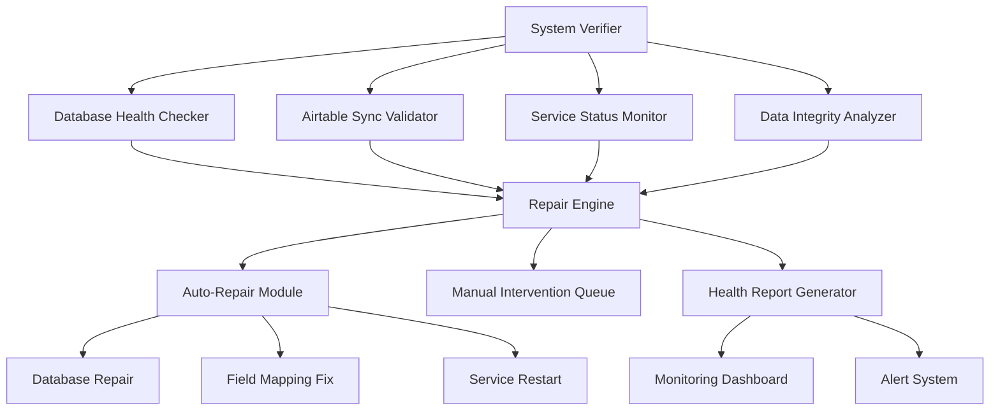

# Design Document

## Overview

The EC2 System Verification and Repair solution is designed to diagnose, identify, and automatically fix critical issues affecting the 4Runr AI Lead System deployed on EC2. Based on the current system architecture analysis, this solution will address data integrity issues, Airtable synchronization problems, and overall system health monitoring.

## Architecture

### System Components



### Core Architecture Principles

1. **Non-Destructive Verification**: All checks are read-only until repair is explicitly authorized
2. **Incremental Repair**: Fixes are applied in small, reversible steps
3. **Comprehensive Logging**: Every action is logged with rollback information
4. **Fail-Safe Design**: System continues operating even if verification fails

## Components and Interfaces

### 1. System Verifier (Main Controller)

**Purpose**: Orchestrates all verification and repair operations

**Key Methods**:
```python
class SystemVerifier:
    def run_full_verification(self) -> VerificationReport
    def run_targeted_check(self, component: str) -> ComponentReport
    def execute_repairs(self, repair_plan: RepairPlan) -> RepairResult
    def generate_health_report(self) -> HealthReport
```

**Configuration**:
- Database paths for all system components
- Airtable connection parameters
- Service monitoring endpoints
- Repair automation rules

### 2. Database Health Checker

**Purpose**: Validates database integrity, schema consistency, and data quality

**Key Checks**:
- Database file existence and accessibility
- Schema validation against expected structure
- Data consistency between local and Airtable
- Record count verification
- Field mapping validation

**Database Locations Monitored**:
- `/home/ubuntu/4Runr-AI-Lead-System/data/leads.db` (Main database)
- `/home/ubuntu/4Runr-AI-Lead-System/4runr-outreach-system/data/leads_cache.db` (Cache database)
- `/home/ubuntu/4Runr-AI-Lead-System/4runr-lead-scraper/data/leads.db` (Scraper database)
- `/home/ubuntu/4Runr-AI-Lead-System/4runr-outreach-system/campaign_system/campaigns.db` (Campaign database)

### 3. Airtable Sync Validator

**Purpose**: Ensures Airtable integration is working correctly

**Key Validations**:
- API key authentication
- Base and table accessibility
- Field mapping accuracy
- Data synchronization status
- Record count consistency

**Field Mapping Verification**:
```python
EXPECTED_AIRTABLE_FIELDS = {
    'Company_Description': 'Long text',
    'Business_Type': 'Single line text', 
    'AI Message': 'Long text',
    'Full Name': 'Single line text',
    'LinkedIn URL': 'Single line text',
    'Company': 'Single line text',
    'Email': 'Single line text',
    'Website': 'Single line text',
    'Engagement_Status': 'Single select',
    'Date Messaged': 'Date'
}
```

### 4. Service Status Monitor

**Purpose**: Monitors all system services and their health

**Services Monitored**:
- Website Scraper (`4runr-outreach-system/website_scraper/app.py`)
- Message Generator (`4runr-outreach-system/message_generator/app.py`)
- Email Engager (`4runr-outreach-system/engager/app.py`)
- Campaign Brain (`4runr-brain/campaign_brain.py`)
- System Controller (`system_controller.py`)
- Cron Jobs (daily sync at 6 AM)

### 5. Data Integrity Analyzer

**Purpose**: Identifies data corruption, missing information, and inconsistencies

**Analysis Areas**:
- Lead record completeness
- Email format validation
- Company data consistency
- AI message quality scores
- Engagement status accuracy
- Date field validation

### 6. Auto-Repair Module

**Purpose**: Automatically fixes common issues without manual intervention

**Automated Repairs**:
- Database schema corrections
- Field mapping updates
- Service restarts
- Data format standardization
- Duplicate record removal
- Missing field population

### 7. Manual Intervention Queue

**Purpose**: Manages issues requiring human review

**Queue Categories**:
- Critical data corruption requiring review
- API key or authentication failures
- Complex field mapping conflicts
- Service configuration errors

## Data Models

### VerificationReport

```python
@dataclass
class VerificationReport:
    timestamp: datetime
    overall_status: SystemStatus
    component_reports: Dict[str, ComponentReport]
    critical_issues: List[Issue]
    warnings: List[Warning]
    repair_recommendations: List[RepairAction]
    system_metrics: SystemMetrics
```

### ComponentReport

```python
@dataclass
class ComponentReport:
    component_name: str
    status: ComponentStatus
    checks_performed: List[Check]
    issues_found: List[Issue]
    performance_metrics: Dict[str, Any]
    last_successful_operation: Optional[datetime]
```

### Issue

```python
@dataclass
class Issue:
    severity: IssueSeverity  # CRITICAL, HIGH, MEDIUM, LOW
    category: IssueCategory  # DATABASE, AIRTABLE, SERVICE, DATA
    description: str
    affected_records: Optional[List[str]]
    suggested_repair: Optional[RepairAction]
    auto_repairable: bool
```

### RepairAction

```python
@dataclass
class RepairAction:
    action_type: RepairType
    description: str
    affected_components: List[str]
    rollback_plan: Optional[RollbackPlan]
    estimated_duration: timedelta
    risk_level: RiskLevel
```

## Error Handling

### Error Categories

1. **Database Errors**
   - Connection failures
   - Schema mismatches
   - Data corruption
   - Lock timeouts

2. **Airtable Errors**
   - Authentication failures
   - Rate limiting
   - Field mapping errors
   - Sync conflicts

3. **Service Errors**
   - Process crashes
   - Configuration errors
   - Resource exhaustion
   - Network connectivity

### Error Recovery Strategies

1. **Graceful Degradation**: System continues with reduced functionality
2. **Automatic Retry**: Transient errors are retried with exponential backoff
3. **Fallback Modes**: Alternative processing paths for critical functions
4. **Circuit Breakers**: Prevent cascading failures

### Rollback Mechanisms

```python
class RollbackManager:
    def create_checkpoint(self, component: str) -> CheckpointId
    def rollback_to_checkpoint(self, checkpoint_id: CheckpointId) -> bool
    def cleanup_old_checkpoints(self, retention_days: int) -> None
```

## Testing Strategy

### Unit Testing

- Individual component verification logic
- Data validation functions
- Repair action implementations
- Error handling scenarios

### Integration Testing

- End-to-end verification workflows
- Database interaction testing
- Airtable API integration
- Service monitoring accuracy

### System Testing

- Full system verification on production-like environment
- Performance testing with large datasets
- Failure scenario simulation
- Recovery time measurement

### Test Data Management

```python
class TestDataManager:
    def create_test_database(self) -> str
    def populate_with_sample_data(self, db_path: str) -> None
    def create_corrupted_data_scenarios(self) -> List[CorruptionScenario]
    def cleanup_test_data(self) -> None
```

## Implementation Phases

### Phase 1: Core Verification Framework
- System verifier controller
- Database health checker
- Basic reporting infrastructure
- Configuration management

### Phase 2: Airtable Integration Validation
- Airtable sync validator
- Field mapping verification
- Data consistency checks
- Sync status monitoring

### Phase 3: Service Monitoring
- Service status monitor
- Process health checks
- Performance metrics collection
- Alert system integration

### Phase 4: Auto-Repair Capabilities
- Auto-repair module
- Common issue resolution
- Rollback mechanisms
- Safety checks

### Phase 5: Advanced Analytics
- Data integrity analyzer
- Trend analysis
- Predictive issue detection
- Performance optimization

## Configuration Management

### Environment-Specific Settings

```python
# Production Configuration
PRODUCTION_CONFIG = {
    'database_paths': {
        'main': '/home/ubuntu/4Runr-AI-Lead-System/data/leads.db',
        'cache': '/home/ubuntu/4Runr-AI-Lead-System/4runr-outreach-system/data/leads_cache.db',
        'scraper': '/home/ubuntu/4Runr-AI-Lead-System/4runr-lead-scraper/data/leads.db',
        'campaigns': '/home/ubuntu/4Runr-AI-Lead-System/4runr-outreach-system/campaign_system/campaigns.db'
    },
    'airtable': {
        'base_id': 'appBZvPvNXGqtoJdc',
        'table_name': 'Table 1',
        'api_key_env': 'AIRTABLE_API_KEY'
    },
    'services': {
        'website_scraper': '4runr-outreach-system/website_scraper/app.py',
        'message_generator': '4runr-outreach-system/message_generator/app.py',
        'engager': '4runr-outreach-system/engager/app.py',
        'brain': '4runr-brain/campaign_brain.py'
    },
    'repair_settings': {
        'auto_repair_enabled': True,
        'backup_before_repair': True,
        'max_auto_repair_attempts': 3,
        'require_confirmation_for_critical': True
    }
}
```

## Security Considerations

### Data Protection
- All database operations use read-only connections for verification
- Sensitive data is masked in logs and reports
- API keys are never logged or exposed
- Backup creation before any repair operations

### Access Control
- Verification operations require appropriate permissions
- Repair operations have additional authorization requirements
- Audit logging for all system modifications
- Role-based access to different repair capabilities

### Network Security
- Secure API communications with Airtable
- Encrypted storage of sensitive configuration
- Network isolation for database operations
- Rate limiting for external API calls

## Monitoring and Alerting

### Health Metrics
- System uptime and availability
- Database performance metrics
- Airtable sync success rates
- Service response times
- Error rates and patterns

### Alert Conditions
- Critical system failures
- Data integrity violations
- Service unavailability
- Performance degradation
- Repair operation failures

### Dashboard Integration
- Real-time system status display
- Historical trend analysis
- Issue tracking and resolution
- Performance metrics visualization