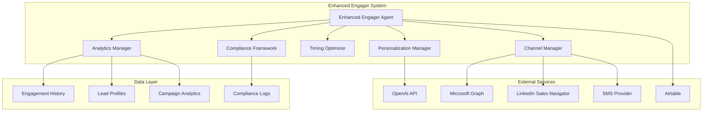

# Design Document

## Overview

The Engager System Enhancements will transform the existing 4runr engager agent into an intelligent, multi-channel outreach platform with advanced AI-driven personalization and sophisticated engagement optimization. The enhanced system will build upon the current Microsoft Graph email delivery foundation while adding LinkedIn messaging, SMS capabilities, intelligent timing, advanced analytics, and robust compliance features.

The design follows a modular architecture that extends the existing `EngagerAgent` class with new specialized components for channel management, AI personalization, timing optimization, and comprehensive analytics. This approach ensures backward compatibility while enabling powerful new capabilities.

## Architecture

### High-Level Architecture



### Core Components

1. **Enhanced Engager Agent**: Main orchestration layer that coordinates all enhancement modules
2. **Personalization Manager**: AI-driven content personalization and behavioral analysis
3. **Channel Manager**: Multi-channel delivery with intelligent channel selection
4. **Timing Optimizer**: AI-powered send time optimization and frequency management
5. **Analytics Manager**: Advanced engagement tracking and performance insights
6. **Compliance Framework**: Regulatory compliance and deliverability management

## Components and Interfaces

### Enhanced Engager Agent

The core `EngagerAgent` class will be extended with new capabilities while maintaining the existing interface:

```python
class EnhancedEngagerAgent(EngagerAgent):
    def __init__(self):
        super().__init__()
        self.personalization_manager = PersonalizationManager()
        self.channel_manager = ChannelManager()
        self.timing_optimizer = TimingOptimizer()
        self.analytics_manager = AnalyticsManager()
        self.compliance_framework = ComplianceFramework()
    
    def process_leads_enhanced(self, limit: int = None) -> Dict[str, Any]:
        """Enhanced lead processing with AI personalization and multi-channel delivery"""
        
    def _process_single_lead_enhanced(self, lead: Dict[str, Any]) -> Dict[str, str]:
        """Enhanced single lead processing with full feature set"""
```

### Personalization Manager

Handles AI-driven message personalization and behavioral analysis:

```python
class PersonalizationManager:
    def __init__(self):
        self.openai_client = OpenAI()
        self.behavior_analyzer = BehaviorAnalyzer()
        self.content_personalizer = ContentPersonalizer()
    
    def personalize_message(self, lead: Dict[str, Any], base_message: str) -> Dict[str, Any]:
        """Generate personalized message based on lead behavior and context"""
        
    def analyze_lead_behavior(self, lead_id: str) -> Dict[str, Any]:
        """Analyze lead engagement patterns and preferences"""
        
    def get_personalization_insights(self, lead: Dict[str, Any]) -> Dict[str, Any]:
        """Extract insights for message personalization"""
```

### Channel Manager

Manages multi-channel delivery with intelligent channel selection:

```python
class ChannelManager:
    def __init__(self):
        self.email_handler = EmailHandler()
        self.linkedin_handler = LinkedInHandler()
        self.sms_handler = SMSHandler()
        self.channel_selector = ChannelSelector()
    
    def select_optimal_channel(self, lead: Dict[str, Any]) -> str:
        """Select the best delivery channel based on lead preferences and history"""
        
    def send_message(self, lead: Dict[str, Any], message: str, channel: str) -> Dict[str, Any]:
        """Send message through the specified channel"""
        
    def get_channel_availability(self, lead: Dict[str, Any]) -> Dict[str, bool]:
        """Check which channels are available for the lead"""
```

### Timing Optimizer

Optimizes send timing and manages engagement frequency:

```python
class TimingOptimizer:
    def __init__(self):
        self.timing_analyzer = TimingAnalyzer()
        self.frequency_manager = FrequencyManager()
        self.schedule_optimizer = ScheduleOptimizer()
    
    def get_optimal_send_time(self, lead: Dict[str, Any]) -> datetime:
        """Determine optimal send time based on lead timezone and behavior"""
        
    def check_frequency_limits(self, lead_id: str) -> Dict[str, Any]:
        """Check if lead can be contacted based on frequency rules"""
        
    def schedule_follow_up(self, lead: Dict[str, Any], message_type: str) -> datetime:
        """Schedule optimal follow-up timing"""
```

### Analytics Manager

Provides advanced engagement tracking and performance insights:

```python
class AnalyticsManager:
    def __init__(self):
        self.engagement_tracker = EngagementTracker()
        self.performance_analyzer = PerformanceAnalyzer()
        self.insight_generator = InsightGenerator()
    
    def track_engagement(self, engagement_data: Dict[str, Any]) -> None:
        """Track detailed engagement metrics"""
        
    def generate_performance_report(self, timeframe: str) -> Dict[str, Any]:
        """Generate comprehensive performance analytics"""
        
    def get_optimization_recommendations(self) -> List[Dict[str, Any]]:
        """Generate AI-driven optimization recommendations"""
```

### Compliance Framework

Ensures regulatory compliance and manages deliverability:

```python
class ComplianceFramework:
    def __init__(self):
        self.gdpr_validator = GDPRValidator()
        self.canspam_validator = CANSPAMValidator()
        self.deliverability_monitor = DeliverabilityMonitor()
        self.suppression_manager = SuppressionManager()
    
    def validate_compliance(self, lead: Dict[str, Any], message: str) -> Dict[str, Any]:
        """Validate compliance with all applicable regulations"""
        
    def check_suppression_lists(self, email: str) -> bool:
        """Check if email is on any suppression lists"""
        
    def monitor_sender_reputation(self) -> Dict[str, Any]:
        """Monitor and report on sender reputation metrics"""
```

## Data Models

### Enhanced Lead Profile

Extended lead data structure with behavioral insights:

```python
@dataclass
class EnhancedLeadProfile:
    # Existing fields from current system
    lead_id: str
    name: str
    email: str
    company: str
    
    # New behavioral fields
    engagement_history: List[EngagementEvent]
    preferred_channels: List[str]
    optimal_send_times: Dict[str, str]  # day_of_week: time
    response_patterns: Dict[str, Any]
    personalization_insights: Dict[str, Any]
    compliance_status: Dict[str, bool]
```

### Engagement Event

Detailed engagement tracking:

```python
@dataclass
class EngagementEvent:
    event_id: str
    lead_id: str
    timestamp: datetime
    channel: str
    message_type: str
    engagement_type: str  # sent, opened, clicked, replied, etc.
    message_content: str
    response_data: Optional[Dict[str, Any]]
    success: bool
    error_details: Optional[str]
```

### Channel Configuration

Multi-channel delivery configuration:

```python
@dataclass
class ChannelConfig:
    channel_name: str
    enabled: bool
    priority: int
    rate_limits: Dict[str, int]
    authentication: Dict[str, str]
    compliance_settings: Dict[str, Any]
```

## Error Handling

### Intelligent Retry Logic

The enhanced system implements sophisticated retry mechanisms:

1. **Exponential Backoff**: Progressive delay increases for temporary failures
2. **Circuit Breaker**: Automatic service isolation during extended outages
3. **Graceful Degradation**: Fallback to alternative channels when primary fails
4. **State Preservation**: Maintains engagement state across failures and restarts

### Error Classification

```python
class ErrorClassifier:
    def classify_error(self, error: Exception, context: Dict[str, Any]) -> ErrorType:
        """Classify errors for appropriate handling strategy"""
        
    def get_retry_strategy(self, error_type: ErrorType) -> RetryStrategy:
        """Determine optimal retry approach based on error type"""
```

### Recovery Mechanisms

- **Database Transactions**: Atomic operations with rollback capabilities
- **Message Queue**: Persistent queue for failed deliveries
- **Health Checks**: Continuous monitoring of system components
- **Alerting**: Real-time notifications for critical failures

## Testing Strategy

### Unit Testing

- **Component Isolation**: Test each manager independently
- **Mock External Services**: Simulate API responses and failures
- **Edge Case Coverage**: Test boundary conditions and error scenarios
- **Performance Testing**: Validate response times and resource usage

### Integration Testing

- **End-to-End Workflows**: Test complete engagement processes
- **Multi-Channel Scenarios**: Validate channel switching and fallbacks
- **Compliance Validation**: Ensure regulatory requirements are met
- **Data Consistency**: Verify data integrity across components

### Load Testing

- **Concurrent Processing**: Test system under high lead volumes
- **Rate Limit Handling**: Validate proper rate limiting behavior
- **Resource Scaling**: Test system behavior under resource constraints
- **Failure Recovery**: Test recovery from various failure scenarios

### A/B Testing Framework

Built-in capabilities for testing engagement strategies:

```python
class ABTestingFramework:
    def create_test(self, test_config: Dict[str, Any]) -> str:
        """Create new A/B test for engagement strategies"""
        
    def assign_variant(self, lead_id: str, test_id: str) -> str:
        """Assign lead to test variant"""
        
    def track_results(self, test_id: str) -> Dict[str, Any]:
        """Track and analyze test results"""
```

## Security Considerations

### Data Protection

- **Encryption**: All sensitive data encrypted at rest and in transit
- **Access Control**: Role-based access to system components
- **Audit Logging**: Comprehensive logging of all system activities
- **Data Retention**: Configurable retention policies for compliance

### API Security

- **Authentication**: Secure token-based authentication for all APIs
- **Rate Limiting**: Protection against abuse and DoS attacks
- **Input Validation**: Comprehensive validation of all inputs
- **Error Handling**: Secure error responses without information leakage

### Compliance Integration

- **GDPR Compliance**: Built-in data subject rights management
- **CAN-SPAM Compliance**: Automatic unsubscribe handling
- **Data Minimization**: Collect and retain only necessary data
- **Consent Management**: Track and respect user consent preferences

## Performance Optimization

### Caching Strategy

- **Lead Data Caching**: Cache frequently accessed lead information
- **AI Response Caching**: Cache similar personalization requests
- **Channel Status Caching**: Cache channel availability and limits
- **Analytics Caching**: Cache computed metrics and reports

### Database Optimization

- **Indexing Strategy**: Optimize queries with appropriate indexes
- **Connection Pooling**: Efficient database connection management
- **Query Optimization**: Minimize database round trips
- **Partitioning**: Partition large tables for better performance

### Asynchronous Processing

- **Message Queue**: Asynchronous processing of engagement tasks
- **Background Jobs**: Non-blocking execution of analytics and reporting
- **Event-Driven Architecture**: Reactive processing based on system events
- **Batch Processing**: Efficient bulk operations for large datasets