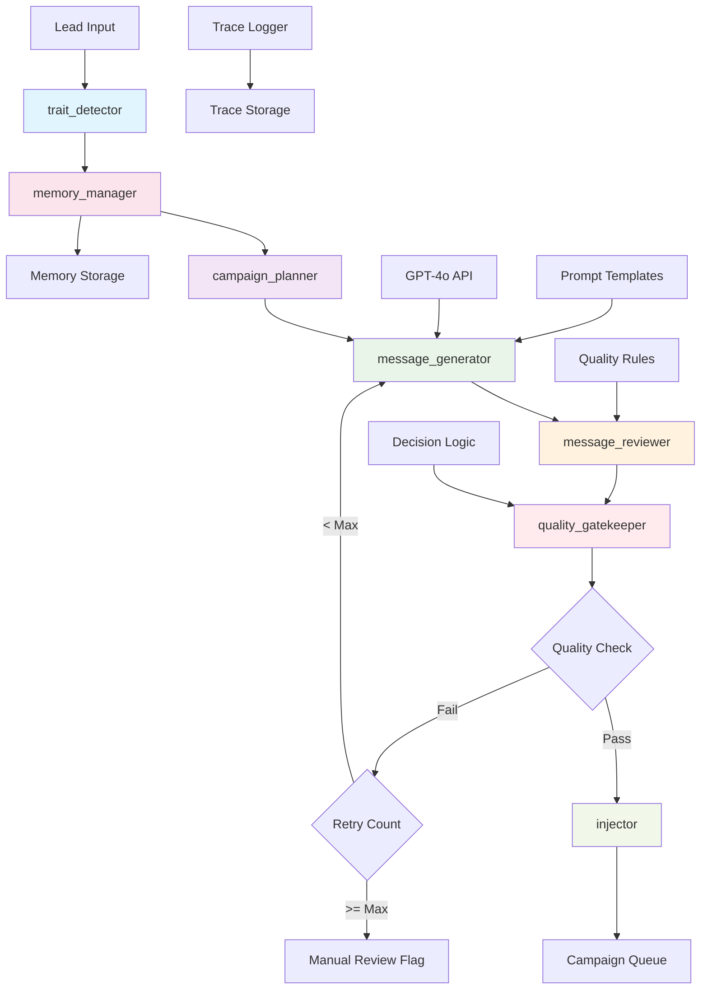

# Design Document: LangGraph Campaign Brain System

## Overview

The LangGraph Campaign Brain System represents a paradigm shift from rule-based campaign management to an intelligent AI agent that dynamically orchestrates the entire outreach process. This system serves as the "thinking layer" of the 4Runr Autonomous Outreach System, leveraging LangGraph's state machine capabilities to create a sophisticated decision-making framework that adapts to lead characteristics, learns from outcomes, and continuously optimizes campaign strategies.

The system replaces static campaign flows with a dynamic graph of interconnected nodes that collaborate to analyze leads, plan campaigns, generate messages, evaluate quality, and manage delivery. Each node specializes in a specific aspect of campaign management while contributing to a cohesive, intelligent workflow that maintains 4Runr's elevated brand positioning and strategic approach.

## Architecture

The LangGraph Campaign Brain implements a node-based architecture where each component represents a specialized decision-making unit within the overall campaign intelligence system:



### Core Node Architecture

Each node in the LangGraph system follows a consistent interface pattern:

```python
class CampaignNode:
    def __init__(self, config: Dict[str, Any]):
        self.config = config
        self.logger = get_logger(self.__class__.__name__)
    
    async def execute(self, state: CampaignState) -> CampaignState:
        """Execute node logic and return updated state"""
        pass
    
    def validate_input(self, state: CampaignState) -> bool:
        """Validate required input data"""
        pass
    
    def handle_error(self, error: Exception, state: CampaignState) -> CampaignState:
        """Handle node-specific errors"""
        pass
```

### State Management

The campaign state flows through the graph, accumulating data and decisions:

```python
class CampaignState:
    # Lead Information
    lead_data: Dict[str, Any]
    company_data: Dict[str, Any]
    scraped_content: Dict[str, Any]
    
    # Detected Traits
    traits: List[str]
    trait_confidence: Dict[str, float]
    trait_reasoning: Dict[str, str]
    
    # Campaign Planning
    campaign_sequence: List[str]
    messaging_angle: str
    campaign_tone: str
    
    # Message Generation
    messages: List[Dict[str, Any]]
    generation_attempts: Dict[str, int]
    
    # Quality Assessment
    quality_scores: Dict[str, float]
    quality_issues: List[str]
    quality_feedback: Dict[str, List[str]]
    
    # Decision Tracking
    decision_path: List[str]
    retry_count: int
    final_status: str
    
    # Memory and Context
    memory_context: Dict[str, Any]
    execution_metadata: Dict[str, Any]
```

## Components and Interfaces

### 1. Trait Detector Node

The trait detector analyzes lead and company data to identify strategic characteristics that inform campaign planning.

**Interface:**
```python
class TraitDetectorNode(CampaignNode):
    async def execute(self, state: CampaignState) -> CampaignState:
        """
        Analyze lead data and website content to detect traits
        
        Input: lead_data, company_data, scraped_content
        Output: traits, trait_confidence, trait_reasoning
        """
```

**Implementation Details:**
- **Rule-Based Detection**: Initial implementation uses pattern matching and keyword analysis
- **Company Analysis**: Identifies business model, technology stack, market position, growth stage
- **Decision Maker Analysis**: Determines role-specific traits, seniority level, likely priorities
- **Website Content Analysis**: Extracts tone, messaging style, strategic positioning
- **Confidence Scoring**: Assigns confidence levels to detected traits
- **Future GPT Enhancement**: Architecture supports upgrade to GPT-based trait detection

**Trait Categories:**
- **Business Model**: enterprise, smb, startup, agency, consultancy
- **Technology**: saas, api_first, cloud_native, mobile_first, ai_powered
- **Industry**: fintech, healthtech, edtech, travel_tech, ecommerce
- **Market Position**: market_leader, challenger, disruptor, niche_player
- **Growth Stage**: early_stage, scaling, mature, transformation
- **Communication Style**: formal, casual, technical, executive, creative

### 2. Campaign Planner Node

The campaign planner maps detected traits to optimal messaging sequences and strategic approaches.

**Interface:**
```python
class CampaignPlannerNode(CampaignNode):
    async def execute(self, state: CampaignState) -> CampaignState:
        """
        Map traits to optimal campaign sequences and messaging angles
        
        Input: traits, trait_confidence, memory_context
        Output: campaign_sequence, messaging_angle, campaign_tone
        """
```

**Implementation Details:**
- **Trait Mapping**: Maps trait combinations to proven campaign sequences
- **Sequence Optimization**: Uses performance data to improve trait-to-sequence mappings
- **Messaging Angle Selection**: Chooses strategic approach based on lead characteristics
- **Tone Matching**: Balances company communication style with 4Runr positioning
- **Fallback Logic**: Provides default sequences for unknown trait combinations
- **Performance Learning**: Incorporates campaign outcome data for continuous improvement

**Campaign Sequences:**
- **Standard**: ["hook", "proof", "fomo"] - Default three-message sequence
- **Executive**: ["insight", "strategic_proof", "competitive_fomo"] - C-level focused
- **Technical**: ["technical_hook", "architecture_proof", "innovation_fomo"] - CTO/Engineering
- **Startup**: ["growth_hook", "scaling_proof", "opportunity_fomo"] - High-growth companies
- **Enterprise**: ["transformation_hook", "enterprise_proof", "timing_fomo"] - Large organizations

**Messaging Angles:**
- **Competitive Advantage**: Focus on market differentiation and strategic positioning
- **Operational Efficiency**: Emphasize process optimization and cost reduction
- **Innovation Leadership**: Highlight cutting-edge capabilities and future readiness
- **Growth Acceleration**: Focus on scaling and expansion opportunities
- **Risk Mitigation**: Address security, compliance, and stability concerns

### 3. Message Generator Node

The message generator uses GPT-4o with specialized prompts to create personalized campaign messages.

**Interface:**
```python
class MessageGeneratorNode(CampaignNode):
    async def execute(self, state: CampaignState) -> CampaignState:
        """
        Generate messages using GPT-4o and specialized prompts
        
        Input: campaign_sequence, messaging_angle, campaign_tone, lead_data
        Output: messages (with subject and body for each type)
        """
```

**Implementation Details:**
- **GPT-4o Integration**: Uses latest OpenAI model for superior message generation
- **Modular Prompts**: Loads specialized .j2 templates for each message type
- **Dynamic Personalization**: Incorporates traits, company insights, and messaging angles
- **Consistency Management**: Ensures coherent narrative across message sequence
- **Retry Logic**: Implements intelligent retry with prompt variations
- **Quality Pre-filtering**: Basic quality checks before passing to reviewer

**Prompt Template Structure:**
```jinja2
# hook.j2 example
You are a strategic outreach specialist for 4Runr, creating the first message in a campaign sequence.

LEAD CONTEXT:
- Name: {{ lead_data.name }}
- Role: {{ lead_data.title }}
- Company: {{ lead_data.company }}

COMPANY INSIGHTS:
- Description: {{ company_data.description }}
- Services: {{ company_data.services }}
- Tone: {{ company_data.tone }}

STRATEGIC CONTEXT:
- Detected Traits: {{ traits | join(', ') }}
- Messaging Angle: {{ messaging_angle }}
- Campaign Tone: {{ campaign_tone }}

REQUIREMENTS:
- Create a hook message that {{ messaging_angle_instructions[messaging_angle] }}
- Match the {{ campaign_tone }} tone while maintaining 4Runr's strategic positioning
- Include specific references to {{ company_data.company }} and {{ lead_data.title }} role
- Focus on {{ trait_specific_focus[primary_trait] }}
- Keep under 150 words
- Include compelling subject line

Generate both subject line and message body.
```

### 4. Message Reviewer Node

The message reviewer evaluates generated messages across multiple quality dimensions.

**Interface:**
```python
class MessageReviewerNode(CampaignNode):
    async def execute(self, state: CampaignState) -> CampaignState:
        """
        Evaluate message quality across multiple dimensions
        
        Input: messages, lead_data, company_data, traits
        Output: quality_scores, quality_issues, quality_feedback
        """
```

**Implementation Details:**
- **Multi-Dimensional Scoring**: Evaluates personalization, strategic insight, tone fit, clarity
- **Personalization Assessment**: Checks for lead name, company name, industry references
- **Strategic Value Analysis**: Evaluates business insight and value proposition strength
- **Tone Consistency**: Validates alignment with company communication style
- **Clarity and Readability**: Assesses message structure and call-to-action effectiveness
- **Brand Compliance**: Ensures adherence to 4Runr positioning and voice guidelines
- **Detailed Feedback**: Provides specific improvement suggestions for failed messages

**Quality Scoring Framework:**
```python
class QualityMetrics:
    personalization_score: float  # 0-100, weighted 25%
    strategic_insight_score: float  # 0-100, weighted 30%
    tone_fit_score: float  # 0-100, weighted 20%
    clarity_score: float  # 0-100, weighted 15%
    brand_compliance_score: float  # 0-100, weighted 10%
    
    overall_score: float  # Weighted average
    pass_threshold: float = 80.0
```

**Quality Checks:**
- **Personalization**: Lead name usage, company-specific references, role-appropriate language
- **Strategic Insight**: Market observations, competitive positioning, business value
- **Tone Consistency**: Formal vs. casual alignment, executive vs. technical language
- **Clarity**: Message structure, clear value proposition, effective call-to-action
- **Brand Compliance**: 4Runr voice, strategic positioning, professional presentation

### 5. Quality Gatekeeper Node

The quality gatekeeper makes pass/fail decisions and manages retry logic.

**Interface:**
```python
class QualityGatekeeperNode(CampaignNode):
    async def execute(self, state: CampaignState) -> CampaignState:
        """
        Make pass/fail decisions and manage retry logic
        
        Input: quality_scores, quality_issues, retry_count
        Output: final_status, decision_path, retry_instructions
        """
```

**Implementation Details:**
- **Threshold-Based Decisions**: Uses configurable score thresholds (default ≥80)
- **Retry Management**: Implements intelligent retry with maximum attempt limits
- **Escalation Logic**: Flags campaigns for manual review after retry exhaustion
- **Decision Reasoning**: Provides detailed explanations for pass/fail decisions
- **Performance Tracking**: Logs decision outcomes for threshold optimization
- **Adaptive Thresholds**: Supports dynamic threshold adjustment based on performance

**Decision Logic:**
```python
def make_quality_decision(self, state: CampaignState) -> str:
    overall_score = state.quality_scores.get('overall_score', 0)
    retry_count = state.retry_count
    
    if overall_score >= self.config.pass_threshold:
        return "PASS"
    elif retry_count < self.config.max_retries:
        return "RETRY"
    else:
        return "MANUAL_REVIEW"
```

### 6. Injector Node

The injector manages approved campaign delivery, routing to either email queue or LinkedIn manual messaging based on lead characteristics.

**Interface:**
```python
class InjectorNode(CampaignNode):
    async def execute(self, state: CampaignState) -> CampaignState:
        """
        Route approved campaigns to appropriate delivery method
        
        Input: messages, final_status, lead_data
        Output: injection_status, delivery_method, queue_id/airtable_update
        """
```

**Implementation Details:**
- **Delivery Routing**: Determines email queue vs LinkedIn manual based on lead email availability
- **Email Queue Integration**: Interfaces with existing MessageQueue system for leads with valid emails
- **LinkedIn Campaign Formatting**: Creates formatted text blocks for manual LinkedIn outreach
- **Airtable Integration**: Updates AI Message field and Messaging Method for LinkedIn leads
- **Status Management**: Updates campaign status based on delivery method and success/failure
- **Error Handling**: Implements retry logic for both injection types
- **State Consistency**: Maintains campaign state across all system components

**LinkedIn Campaign Formatting:**
```python
def format_linkedin_campaign(self, messages: List[Dict], lead_data: Dict) -> str:
    """
    Format campaign messages for LinkedIn manual sending
    
    Returns formatted string like:
    HOOK: Hey {{first_name}}, saw what you're building at {{company}} — curious, have you explored how your [system] could evolve with smarter infrastructure?
    
    PROOF: Quick context — we recently helped a similar SaaS team cut response latency by 40% by streamlining internal systems. Happy to share the details.
    
    FOMO: Noticed a few others in your space moving fast here. Worth a quick chat before this window closes?
    """
```

### 7. Memory Manager Node

The memory manager tracks lead interactions and campaign history for informed decision-making.

**Interface:**
```python
class MemoryManagerNode(CampaignNode):
    async def execute(self, state: CampaignState) -> CampaignState:
        """
        Manage lead memory and campaign history
        
        Input: lead_data, campaign_state, execution_results
        Output: memory_context, historical_insights, decision_factors
        """
```

**Implementation Details:**
- **Lead Memory Tracking**: Stores traits, messages attempted, score outcomes, campaign status
- **Historical Analysis**: Provides insights from previous campaign attempts
- **Decision Context**: Informs other nodes with relevant historical data
- **Performance Memory**: Tracks what works for specific lead types and traits
- **Redis Integration**: Uses fast-access storage for real-time memory retrieval
- **Data Retention**: Implements configurable retention policies and cleanup

**Memory Structure:**
```python
class LeadMemory:
    lead_id: str
    traits_history: List[Dict[str, Any]]
    campaign_attempts: List[Dict[str, Any]]
    quality_scores_history: List[float]
    response_history: List[Dict[str, Any]]
    best_performing_angles: List[str]
    failed_approaches: List[str]
    last_contact_date: datetime
    total_attempts: int
    success_rate: float
    delivery_method_history: List[str]  # Track email vs LinkedIn usage
```

## LinkedIn Manual Messaging Workflow

### Lead Classification and Routing

The system automatically classifies leads based on available contact information:

```python
def classify_lead_delivery_method(lead_data: Dict) -> str:
    """
    Determine appropriate delivery method based on lead data
    
    Returns: "email_queue" or "linkedin_manual"
    """
    has_valid_email = lead_data.get('email') and validate_email(lead_data['email'])
    has_linkedin_url = lead_data.get('linkedin_url') and validate_linkedin_url(lead_data['linkedin_url'])
    
    if has_valid_email:
        return "email_queue"
    elif has_linkedin_url:
        return "linkedin_manual"
    else:
        return "insufficient_contact_info"
```

### LinkedIn Campaign Formatting

LinkedIn campaigns are formatted for manual sending with clear section labels and personalization placeholders:

```python
class LinkedInCampaignFormatter:
    def format_campaign(self, messages: List[Dict], lead_data: Dict) -> str:
        """
        Format 3-message campaign for LinkedIn manual sending
        
        Template:
        HOOK: [personalized hook message]
        
        PROOF: [social proof and credibility]
        
        FOMO: [urgency and next steps]
        """
        formatted_sections = []
        
        for message in messages:
            message_type = message['type'].upper()
            content = self.personalize_for_linkedin(message['body'], lead_data)
            formatted_sections.append(f"{message_type}: {content}")
        
        return "\n\n".join(formatted_sections)
    
    def personalize_for_linkedin(self, content: str, lead_data: Dict) -> str:
        """
        Replace specific names with placeholders for manual customization
        """
        content = content.replace(lead_data.get('first_name', ''), '{{first_name}}')
        content = content.replace(lead_data.get('company', ''), '{{company}}')
        return content
```

### Airtable Integration for LinkedIn Leads

```python
class LinkedInAirtableUpdater:
    async def update_linkedin_lead(self, lead_id: str, formatted_campaign: str) -> bool:
        """
        Update Airtable fields for LinkedIn manual messaging
        
        Updates:
        - AI Message: formatted campaign content
        - Messaging Method: "Manual LinkedIn"
        - Manual Message Sent: False (optional checkbox)
        """
        update_data = {
            'AI Message': formatted_campaign,
            'Messaging Method': 'Manual LinkedIn',
            'Manual Message Sent': False  # Optional field for tracking
        }
        
        return await self.airtable_client.update_record(lead_id, update_data)
```

## Data Models

### Campaign State Model

The central data structure that flows through the LangGraph system:

```python
@dataclass
class CampaignState:
    # Execution Metadata
    execution_id: str
    timestamp: datetime
    node_path: List[str]
    
    # Lead Information
    lead_data: Dict[str, Any]
    company_data: Dict[str, Any]
    scraped_content: Dict[str, Any]
    
    # Trait Detection Results
    traits: List[str]
    trait_confidence: Dict[str, float]
    trait_reasoning: Dict[str, str]
    primary_trait: str
    
    # Campaign Planning Results
    campaign_sequence: List[str]
    messaging_angle: str
    campaign_tone: str
    sequence_reasoning: str
    
    # Message Generation Results
    messages: List[Dict[str, Any]]
    generation_attempts: Dict[str, int]
    generation_errors: List[str]
    
    # Quality Assessment Results
    quality_scores: Dict[str, float]
    quality_issues: List[str]
    quality_feedback: Dict[str, List[str]]
    overall_quality_score: float
    
    # Decision Tracking
    decision_path: List[str]
    retry_count: int
    final_status: str
    status_reason: str
    
    # Memory and Context
    memory_context: Dict[str, Any]
    historical_insights: List[str]
    
    # Execution Results
    injection_status: str
    delivery_method: str  # "email_queue" or "linkedin_manual"
    queue_id: Optional[str]  # For email delivery
    airtable_update_status: Optional[str]  # For LinkedIn delivery
    formatted_linkedin_campaign: Optional[str]  # Formatted text for manual sending
    delivery_schedule: Optional[Dict[str, datetime]]
    
    # Error Handling
    errors: List[Dict[str, Any]]
    warnings: List[str]
```

### Message Model

Individual message structure within campaigns:

```python
@dataclass
class CampaignMessage:
    message_type: str  # hook, proof, fomo
    subject: str
    body: str
    generation_attempt: int
    quality_score: float
    quality_issues: List[str]
    personalization_elements: Dict[str, bool]
    strategic_elements: List[str]
    tone_indicators: List[str]
    word_count: int
    readability_score: float
    brand_compliance_score: float
```

### Trace Log Model

Comprehensive execution tracking:

```python
@dataclass
class CampaignTrace:
    trace_id: str
    lead_id: str
    execution_start: datetime
    execution_end: datetime
    total_duration: float
    
    # Node Execution Details
    node_executions: List[Dict[str, Any]]
    decision_points: List[Dict[str, Any]]
    error_events: List[Dict[str, Any]]
    
    # Performance Metrics
    api_calls: Dict[str, int]
    api_latency: Dict[str, float]
    memory_usage: Dict[str, float]
    
    # Final Results
    final_status: str
    quality_score: float
    messages_generated: int
    traits_detected: List[str]
    campaign_sequence: List[str]
    
    # Decision Analysis
    decision_reasoning: List[str]
    quality_feedback: List[str]
    improvement_suggestions: List[str]
```

## Error Handling

### Node-Level Error Handling

Each node implements comprehensive error handling:

```python
class NodeErrorHandler:
    async def handle_error(self, error: Exception, state: CampaignState) -> CampaignState:
        error_info = {
            'node': self.__class__.__name__,
            'error_type': type(error).__name__,
            'error_message': str(error),
            'timestamp': datetime.now(),
            'state_snapshot': self.capture_state_snapshot(state)
        }
        
        state.errors.append(error_info)
        
        if isinstance(error, RetryableError):
            return await self.handle_retryable_error(error, state)
        elif isinstance(error, FatalError):
            return self.handle_fatal_error(error, state)
        else:
            return self.handle_unknown_error(error, state)
```

### Graph-Level Error Recovery

The LangGraph system implements circuit breaker patterns and graceful degradation:

```python
class CampaignGraphErrorHandler:
    def __init__(self):
        self.circuit_breakers = {}
        self.fallback_strategies = {}
    
    async def handle_node_failure(self, node_name: str, error: Exception, state: CampaignState):
        if self.should_circuit_break(node_name, error):
            return await self.execute_fallback_strategy(node_name, state)
        else:
            return await self.retry_with_backoff(node_name, state)
```

## Testing Strategy

### Unit Testing

Each node is independently testable:

```python
class TestTraitDetectorNode:
    async def test_enterprise_trait_detection(self):
        node = TraitDetectorNode(config)
        state = create_test_state_with_enterprise_lead()
        result = await node.execute(state)
        assert "enterprise" in result.traits
        assert result.trait_confidence["enterprise"] > 0.8
    
    async def test_error_handling(self):
        node = TraitDetectorNode(config)
        state = create_invalid_state()
        result = await node.execute(state)
        assert result.final_status == "ERROR"
        assert len(result.errors) > 0
```

### Integration Testing

End-to-end graph execution testing:

```python
class TestCampaignGraph:
    async def test_complete_campaign_flow(self):
        graph = CampaignBrainGraph(config)
        lead_data = load_test_lead()
        result = await graph.execute(lead_data)
        
        assert result.final_status in ["APPROVED", "MANUAL_REVIEW"]
        assert len(result.messages) == 3
        assert result.overall_quality_score > 0
    
    async def test_retry_logic(self):
        graph = CampaignBrainGraph(config)
        # Configure to force quality failures
        result = await graph.execute(low_quality_lead_data)
        
        assert result.retry_count > 0
        assert result.final_status == "MANUAL_REVIEW"
```

### Performance Testing

Load testing and optimization:

```python
class TestCampaignPerformance:
    async def test_concurrent_processing(self):
        graph = CampaignBrainGraph(config)
        leads = generate_test_leads(100)
        
        start_time = time.time()
        results = await asyncio.gather(*[
            graph.execute(lead) for lead in leads
        ])
        execution_time = time.time() - start_time
        
        assert execution_time < 300  # 5 minutes for 100 leads
        assert all(r.final_status != "ERROR" for r in results)
```

## Security and Compliance

### API Security

- **API Key Management**: Secure storage and rotation of GPT-4o API keys
- **Rate Limiting**: Intelligent rate limiting to prevent API abuse
- **Request Validation**: Input sanitization and validation
- **Response Security**: Secure handling of AI-generated content

### Data Protection

- **Lead Data Encryption**: Encryption of sensitive lead information
- **Memory Security**: Secure storage of campaign history and memory
- **Trace Log Security**: Protected storage of execution traces
- **Access Control**: Role-based access to campaign brain functionality

### Compliance

- **GDPR Compliance**: Data retention policies and deletion capabilities
- **CAN-SPAM Compliance**: Integration with existing compliance measures
- **Audit Trails**: Comprehensive logging for compliance reporting
- **Data Governance**: Policies for AI-generated content and decision making

## Performance Optimization

### Caching Strategy

```python
class CampaignCache:
    def __init__(self):
        self.trait_cache = TTLCache(maxsize=1000, ttl=3600)
        self.prompt_cache = TTLCache(maxsize=100, ttl=86400)
        self.quality_cache = TTLCache(maxsize=500, ttl=1800)
    
    async def get_cached_traits(self, lead_signature: str) -> Optional[List[str]]:
        return self.trait_cache.get(lead_signature)
    
    async def cache_traits(self, lead_signature: str, traits: List[str]):
        self.trait_cache[lead_signature] = traits
```

### Parallel Processing

```python
class ParallelCampaignProcessor:
    async def process_batch(self, leads: List[Dict]) -> List[CampaignState]:
        semaphore = asyncio.Semaphore(10)  # Limit concurrent processing
        
        async def process_single_lead(lead):
            async with semaphore:
                return await self.campaign_graph.execute(lead)
        
        return await asyncio.gather(*[
            process_single_lead(lead) for lead in leads
        ])
```

### Resource Management

- **Memory Management**: Efficient state management and garbage collection
- **API Optimization**: Batching and intelligent request management
- **Database Optimization**: Efficient memory storage and retrieval
- **Monitoring**: Real-time performance monitoring and alerting

## Integration Architecture

### LangGraph Integration

```python
from langgraph.graph import StateGraph, END

def create_campaign_brain_graph():
    workflow = StateGraph(CampaignState)
    
    # Add nodes
    workflow.add_node("trait_detector", TraitDetectorNode())
    workflow.add_node("memory_manager", MemoryManagerNode())
    workflow.add_node("campaign_planner", CampaignPlannerNode())
    workflow.add_node("message_generator", MessageGeneratorNode())
    workflow.add_node("message_reviewer", MessageReviewerNode())
    workflow.add_node("quality_gatekeeper", QualityGatekeeperNode())
    workflow.add_node("injector", InjectorNode())
    
    # Define edges
    workflow.add_edge("trait_detector", "memory_manager")
    workflow.add_edge("memory_manager", "campaign_planner")
    workflow.add_edge("campaign_planner", "message_generator")
    workflow.add_edge("message_generator", "message_reviewer")
    workflow.add_edge("message_reviewer", "quality_gatekeeper")
    
    # Conditional edges for retry logic
    workflow.add_conditional_edges(
        "quality_gatekeeper",
        should_retry,
        {
            "retry": "message_generator",
            "approve": "injector",
            "manual_review": END
        }
    )
    
    workflow.add_edge("injector", END)
    workflow.set_entry_point("trait_detector")
    
    return workflow.compile()
```

### External Service Integration

- **GPT-4o API**: Advanced message generation with specialized prompts
- **Redis**: Fast memory storage and retrieval
- **Existing Queue System**: Integration with current message delivery
- **Airtable**: Campaign status and result tracking
- **Monitoring Systems**: Performance and error tracking

This design provides a robust, intelligent, and scalable foundation for the LangGraph Campaign Brain System, enabling sophisticated campaign management while maintaining integration with existing 4Runr systems and preserving the brand's strategic positioning.