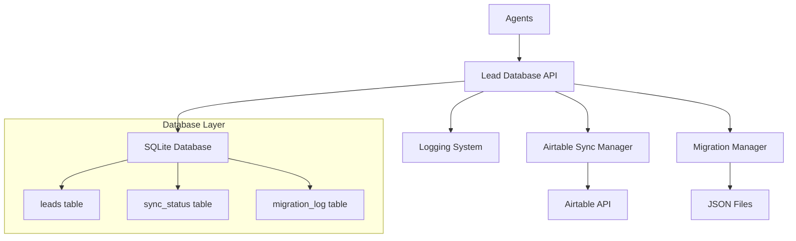

# Design Document

## Overview

The Lead Database Integration system replaces the current JSON file-based lead storage with a robust SQLite database solution. The design ensures data integrity, prevents duplication, maintains Airtable synchronization, and provides a clean API for all agents to interact with lead data safely.

## Architecture

### High-Level Architecture



### Component Architecture

1. **Lead Database API**: Central interface for all lead operations
2. **SQLite Database**: Primary data storage with ACID compliance
3. **Airtable Sync Manager**: Handles bidirectional synchronization
4. **Migration Manager**: Handles JSON to database migration
5. **Logging System**: Comprehensive operation tracking

## Components and Interfaces

### 1. Lead Database API (`lead_database.py`)

**Primary Interface:**
```python
class LeadDatabase:
    def add_lead(self, lead_data: dict) -> str
    def get_lead(self, lead_id: str) -> dict
    def update_lead(self, lead_id: str, updates: dict) -> bool
    def search_leads(self, filters: dict) -> List[dict]
    def get_all_leads(self) -> List[dict]
    def mark_for_sync(self, lead_id: str) -> bool
    def get_sync_pending_leads(self) -> List[dict]
```

**Key Features:**
- Thread-safe operations using connection pooling
- Automatic duplicate detection and merging
- Comprehensive error handling and logging
- UUID-based lead identification

### 2. Database Schema

**leads table:**
```sql
CREATE TABLE leads (
    id TEXT PRIMARY KEY,
    uuid TEXT UNIQUE,
    full_name TEXT NOT NULL,
    linkedin_url TEXT,
    email TEXT,
    company TEXT,
    title TEXT,
    location TEXT,
    industry TEXT,
    company_size TEXT,
    verified BOOLEAN DEFAULT FALSE,
    enriched BOOLEAN DEFAULT FALSE,
    needs_enrichment BOOLEAN DEFAULT TRUE,
    status TEXT DEFAULT 'new',
    source TEXT,
    scraped_at TIMESTAMP,
    enriched_at TIMESTAMP,
    updated_at TIMESTAMP DEFAULT CURRENT_TIMESTAMP,
    created_at TIMESTAMP DEFAULT CURRENT_TIMESTAMP,
    airtable_id TEXT,
    airtable_synced BOOLEAN DEFAULT FALSE,
    sync_pending BOOLEAN DEFAULT TRUE,
    last_sync_attempt TIMESTAMP,
    sync_error TEXT,
    raw_data TEXT  -- JSON blob for additional fields
);
```

**sync_status table:**
```sql
CREATE TABLE sync_status (
    id INTEGER PRIMARY KEY AUTOINCREMENT,
    lead_id TEXT REFERENCES leads(id),
    operation TEXT,  -- 'create', 'update', 'delete'
    status TEXT,     -- 'pending', 'success', 'failed'
    attempt_count INTEGER DEFAULT 0,
    last_attempt TIMESTAMP,
    error_message TEXT,
    created_at TIMESTAMP DEFAULT CURRENT_TIMESTAMP
);
```

**migration_log table:**
```sql
CREATE TABLE migration_log (
    id INTEGER PRIMARY KEY AUTOINCREMENT,
    source_file TEXT,
    leads_migrated INTEGER,
    leads_failed INTEGER,
    migration_date TIMESTAMP DEFAULT CURRENT_TIMESTAMP,
    status TEXT,
    error_details TEXT
);
```

### 3. Airtable Sync Manager (`airtable_sync_manager.py`)

**Interface:**
```python
class AirtableSyncManager:
    def sync_to_airtable(self, lead_ids: List[str]) -> dict
    def sync_from_airtable(self) -> dict
    def bidirectional_sync(self) -> dict
    def handle_sync_conflicts(self, conflicts: List[dict]) -> dict
```

**Sync Strategy:**
- **Push to Airtable**: New/updated leads marked as sync_pending
- **Pull from Airtable**: Periodic full sync to catch external changes
- **Conflict Resolution**: Last-modified-wins with manual override options
- **Retry Logic**: Exponential backoff for failed syncs

### 4. Migration Manager (`migration_manager.py`)

**Interface:**
```python
class MigrationManager:
    def migrate_json_files(self) -> dict
    def backup_json_files(self) -> bool
    def validate_migration(self) -> dict
```

**Migration Process:**
1. Detect existing JSON files in shared directory
2. Create database backup before migration
3. Parse and validate JSON data
4. Insert leads with duplicate detection
5. Create backup copies of original files
6. Generate migration report

### 5. Duplicate Detection Engine

**Detection Logic:**
```python
def find_duplicates(self, lead_data: dict) -> Optional[str]:
    # Priority 1: LinkedIn URL match
    if linkedin_url and existing_lead_with_url:
        return existing_lead_id
    
    # Priority 2: Email match
    if email and existing_lead_with_email:
        return existing_lead_id
    
    # Priority 3: Name + Company match (fuzzy)
    if fuzzy_match(name, company) > 0.85:
        return existing_lead_id
    
    return None
```

## Data Models

### Lead Data Model

```python
@dataclass
class Lead:
    id: str
    uuid: str
    full_name: str
    linkedin_url: Optional[str] = None
    email: Optional[str] = None
    company: Optional[str] = None
    title: Optional[str] = None
    location: Optional[str] = None
    industry: Optional[str] = None
    company_size: Optional[str] = None
    verified: bool = False
    enriched: bool = False
    needs_enrichment: bool = True
    status: str = 'new'
    source: Optional[str] = None
    scraped_at: Optional[datetime] = None
    enriched_at: Optional[datetime] = None
    updated_at: datetime = field(default_factory=datetime.now)
    created_at: datetime = field(default_factory=datetime.now)
    airtable_id: Optional[str] = None
    airtable_synced: bool = False
    sync_pending: bool = True
    raw_data: Optional[dict] = None
```

### Sync Status Model

```python
@dataclass
class SyncStatus:
    lead_id: str
    operation: str  # 'create', 'update', 'delete'
    status: str     # 'pending', 'success', 'failed'
    attempt_count: int = 0
    last_attempt: Optional[datetime] = None
    error_message: Optional[str] = None
```

## Error Handling

### Database Errors
- **Connection Failures**: Automatic retry with exponential backoff
- **Lock Timeouts**: Queue operations and retry
- **Constraint Violations**: Log and provide meaningful error messages
- **Corruption**: Automatic backup restoration

### Sync Errors
- **Airtable API Limits**: Respect rate limits with backoff
- **Network Failures**: Retry with increasing delays
- **Data Validation**: Log invalid data and continue with valid records
- **Conflict Resolution**: Timestamp-based resolution with manual override

### Migration Errors
- **Invalid JSON**: Skip invalid records and log errors
- **Missing Fields**: Use default values and log warnings
- **Duplicate Detection**: Merge data intelligently
- **File Access**: Handle permission and lock issues

## Testing Strategy

### Unit Tests
- Database operations (CRUD)
- Duplicate detection logic
- Data validation
- Error handling

### Integration Tests
- Airtable sync operations
- Migration from JSON files
- Concurrent access scenarios
- End-to-end lead lifecycle

### Performance Tests
- Large dataset handling (10k+ leads)
- Concurrent agent access
- Sync performance with Airtable
- Database query optimization

## Security Considerations

### Data Protection
- SQLite database file permissions (600)
- Environment variable validation
- API key rotation support
- Backup encryption options

### Access Control
- Thread-safe database connections
- Transaction isolation
- Prepared statements for SQL injection prevention
- Input validation and sanitization

## Deployment Strategy

### Database Location
- **Development**: `4runr-agents/data/leads.db`
- **Production**: Configurable via `LEAD_DATABASE_PATH` environment variable
- **Docker**: Mounted volume for persistence

### Migration Process
1. Deploy new database code
2. Run migration script
3. Validate data integrity
4. Switch agents to use database API
5. Monitor for issues
6. Archive JSON files after validation

### Rollback Plan
- Keep JSON backups for 30 days
- Database backup before migration
- Quick rollback script to restore JSON files
- Monitoring alerts for database issues

## Monitoring and Logging

### Metrics to Track
- Lead creation/update rates
- Sync success/failure rates
- Database performance metrics
- Duplicate detection statistics

### Log Levels
- **INFO**: Normal operations, sync results
- **WARNING**: Duplicate detections, minor errors
- **ERROR**: Sync failures, database errors
- **DEBUG**: Detailed operation traces

### Alerting
- Database connection failures
- High sync failure rates
- Data inconsistencies detected
- Performance degradation