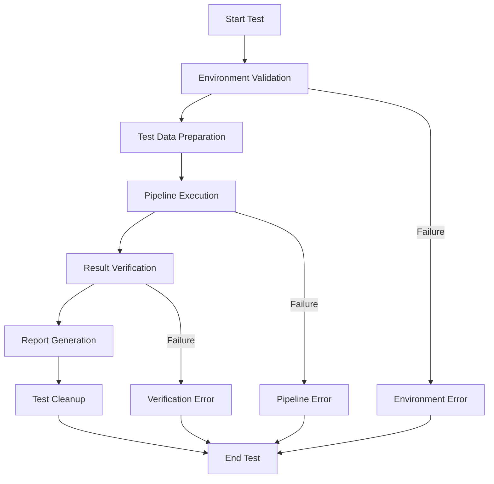

# Design Document: 4Runr AI Lead Scraper System Test Execution

## Overview

The 4Runr AI Lead Scraper System Test Execution feature provides a standardized process for running full system tests on the 4Runr AI Lead Scraper system. This design document outlines the approach for executing end-to-end tests of the lead generation pipeline, including environment validation, test data injection, pipeline execution, and results verification.

The design focuses on creating a reliable, repeatable process that can be executed manually by system administrators or developers to verify system functionality after deployments or changes.

## Architecture

The test execution process follows a sequential workflow that mirrors the actual lead processing pipeline:



## Components and Interfaces

### 1. Test Execution Script

The test execution will be implemented as a batch script (for Windows) and a shell script (for Linux/macOS) that guides the user through the test process.

**Implementation Details:**
- Provides clear step-by-step instructions
- Executes commands to navigate directories, modify files, and run the pipeline
- Captures and displays output from each step
- Handles error conditions and provides guidance

### 2. Test Data Manager

The test data manager handles the creation and injection of test lead data.

**Implementation Details:**
- Provides a template for test lead data
- Injects test data into the shared/leads.json file
- Ensures test data is clearly identifiable
- Provides options for cleanup after test completion

### 3. Pipeline Executor

The pipeline executor runs the full lead processing pipeline.

**Implementation Details:**
- Executes the pipeline using Docker commands
- Monitors execution and captures output
- Detects and reports errors during execution

### 4. Result Verifier

The result verifier checks the outcome of the pipeline execution.

**Implementation Details:**
- Examines logs to verify successful processing
- Checks for error conditions and container crashes
- Verifies data transformation through the pipeline stages

### 5. Environment Validator

The environment validator checks that the system is properly configured for testing.

**Implementation Details:**
- Verifies directory structure and file presence
- Checks Docker container status
- Validates configuration files and environment variables

## Data Models

### Test Lead

```json
{
  "name": "John Test",
  "company": "Acme AI",
  "linkedin_url": "https://linkedin.com/in/fakejohnsmith"
}
```

### Test Result

```json
{
  "test_id": "manual-test-20250723-1",
  "timestamp": "2025-07-23T10:15:30Z",
  "overall_status": "passed",
  "component_results": [
    {
      "component": "environment_validation",
      "status": "passed",
      "details": "All environment checks passed"
    },
    {
      "component": "scraper",
      "status": "passed",
      "details": "Test lead processed successfully"
    },
    {
      "component": "enricher",
      "status": "passed",
      "details": "Lead enriched successfully"
    },
    {
      "component": "engager",
      "status": "passed",
      "details": "Lead processed for outreach"
    }
  ],
  "errors": [],
  "logs": "..."
}
```

## Error Handling

The test execution process implements error handling at multiple levels:

1. **Environment Errors**: Detected during environment validation, with clear instructions for resolution
2. **Pipeline Errors**: Captured during pipeline execution, with component-specific context
3. **Verification Errors**: Identified during result verification, with expected vs. actual results

All errors are documented with:
- Error type and description
- Step where the error occurred
- Relevant log excerpts
- Recommendations for resolution

## Testing Strategy

### Manual Test Execution

The primary use case is manual test execution by system administrators or developers:

1. User runs the test execution script
2. Script guides the user through the test process
3. User follows instructions to inject test data and run the pipeline
4. Script helps the user verify results and interpret logs
5. User documents the test outcome

### Test Data Management

Test data management ensures reliable and consistent testing:

1. Test data is clearly identifiable (using test-specific names and companies)
2. Test data is isolated from production data
3. Test data is cleaned up after test completion
4. Test data includes essential fields for pipeline processing

## Deployment and Execution

### Prerequisites

Before running the test, the following prerequisites must be met:

1. System is deployed on EC2 in the folder: ~/4Runr-AI-Lead-System/4runr-agents
2. Docker containers are active: scraper, enricher, engager, pipeline, cron
3. The `.env` file is present and contains API keys for Airtable, OpenAI, Microsoft Graph, and Make.com

### Execution Steps

The test execution follows these steps:

1. **Navigate to the project folder**:
   ```bash
   cd ~/4Runr-AI-Lead-System/4runr-agents
   ```

2. **Inject test data**:
   ```bash
   nano shared/leads.json
   ```
   Replace content with test lead data.

3. **Run the pipeline**:
   ```bash
   docker-compose exec 4runr-pipeline python run_pipeline.py
   ```

4. **Monitor logs**:
   ```bash
   docker-compose logs -f
   ```

5. **Verify results**:
   Check logs for successful processing of the test lead through all pipeline stages.

### Result Documentation

After test completion, the user documents:

1. Whether the system successfully parsed and enriched the test lead
2. Whether the system sent the outreach via the designated channel
3. Any errors encountered (with logs included)

## Security Considerations

1. **API Key Protection**: The test process never exposes API keys or credentials
2. **Test Data Isolation**: Test data is clearly marked to prevent confusion with real leads
3. **Resource Limitations**: Tests use minimal resources to prevent impact on production systems

## Future Considerations

While not part of the initial implementation, the design accounts for future extensions:

1. **Automated Execution**: Converting the manual process to a fully automated test
2. **Multiple Test Cases**: Expanding to include various test scenarios and edge cases
3. **Integration with CI/CD**: Adding the test to deployment pipelines
4. **Comprehensive Reporting**: Enhancing result documentation and reporting