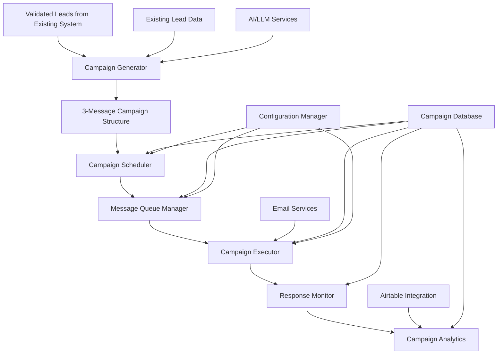
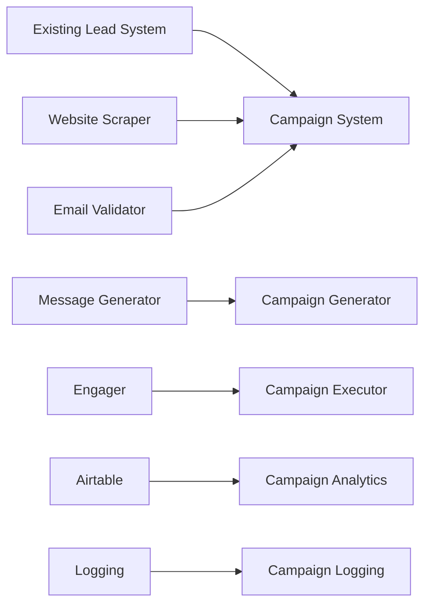

# Design Document: Multi-Step Email Campaign System

## Overview

The Multi-Step Email Campaign System extends the existing 4Runr Autonomous Outreach System with sophisticated email sequencing capabilities. This system transforms single-touch outreach into strategic multi-message campaigns that build relationships through progressive engagement. The system generates three strategically differentiated messages (Hook, Proof, FOMO) per lead, manages automated scheduling with intelligent timing, and provides comprehensive campaign analytics while maintaining 4Runr's elevated brand positioning.

The system integrates seamlessly with the existing lead enrichment pipeline, leveraging validated leads and company insights to create personalized campaign sequences that feel natural and strategic rather than automated or pushy.

## Architecture

The Multi-Step Email Campaign System extends the existing modular architecture with new campaign-focused components while maintaining integration with existing lead processing modules:



### System Integration Points

The campaign system integrates with existing components:

1. **Lead Data Integration**: Uses enriched leads with Company_Description, Top_Services, Tone, and Email_Confidence_Level
2. **Validation Gates**: Leverages existing email validation (Real/Pattern only)
3. **AI Services**: Extends existing AI integration for multi-message generation
4. **Airtable Integration**: Adds campaign fields to existing lead tracking
5. **Logging System**: Integrates with existing logging and monitoring infrastructure

## Components and Interfaces

### 1. Campaign Generator

The Campaign Generator creates complete 3-message campaigns with strategic differentiation and consistent personalization.

**Interface:**
- `generate_campaign(lead_data, company_data)`: Creates complete 3-message campaign
- `generate_hook_message(lead_data, company_data)`: Creates positioning and curiosity message
- `generate_proof_message(lead_data, company_data)`: Creates differentiation and value message  
- `generate_fomo_message(lead_data, company_data)`: Creates urgency and scarcity message
- `validate_campaign_quality(campaign)`: Ensures all messages meet 4Runr standards
- `ensure_message_progression(messages)`: Validates logical flow between messages

**Implementation Details:**
- Integrates with existing AI/LLM services for message generation
- Uses specialized prompts for each message type (Hook, Proof, FOMO)
- Maintains consistent lead traits and company insights across all messages
- Implements 4Runr tone guidelines: bold, strategic, elevated positioning
- Validates message uniqueness and progression logic
- Stores campaigns in structured format with lead_id, company, and message array

**Message Type Specifications:**

*Hook Message (Day 0):*
- Purpose: Grab attention with strategic insight and light CTA
- Tone: Curious, insightful, positioning-focused
- Structure: Industry insight + strategic question + soft connection request
- Example pattern: "Platform evolution insight → Strategic positioning → Light CTA"

*Proof Message (Day 3):*
- Purpose: Show differentiation through proof points without pitching
- Tone: Confident, evidence-based, value-focused
- Structure: Market observation + differentiation proof + value demonstration
- Example pattern: "Market trend → How others win → Subtle capability hint"

*FOMO Message (Day 7):*
- Purpose: Create urgency about competitive advantage and timing
- Tone: Urgent but professional, scarcity-focused
- Structure: Competitive landscape + time sensitivity + final opportunity
- Example pattern: "Competitor movement → Edge compounds → Final connection offer"

### 2. Campaign Scheduler

The Campaign Scheduler manages timing, sequencing, and automated execution of multi-message campaigns.

**Interface:**
- `schedule_campaign(campaign_id, start_date)`: Schedules complete campaign sequence
- `calculate_send_dates(start_date, intervals)`: Determines optimal send timing
- `check_business_days(date)`: Validates business day scheduling
- `handle_timezone_adjustment(date, timezone)`: Adjusts for lead timezone
- `pause_campaign(campaign_id, reason)`: Pauses active campaign
- `resume_campaign(campaign_id)`: Resumes paused campaign

**Implementation Details:**
- Default schedule: Day 0 (Hook), Day 3 (Proof), Day 7 (FOMO)
- Configurable intervals through environment variables
- Business day awareness (skip weekends and holidays)
- Timezone handling for optimal delivery timing
- Campaign pause/resume capabilities for manual intervention
- Integration with existing scheduling infrastructure

### 3. Message Queue Manager

The Message Queue Manager handles message queuing, delivery coordination, and send optimization.

**Interface:**
- `queue_message(message, scheduled_date)`: Adds message to delivery queue
- `process_queue()`: Processes ready messages for sending
- `prioritize_messages(queue)`: Orders messages by priority and timing
- `handle_delivery_failures(message, error)`: Manages failed deliveries
- `update_message_status(message_id, status)`: Updates delivery status
- `get_queue_status()`: Returns current queue statistics

**Implementation Details:**
- Priority-based message queuing system
- Batch processing for efficient delivery
- Retry logic for failed deliveries with exponential backoff
- Rate limiting to respect email service limits
- Dead letter queue for permanently failed messages
- Integration with existing email sending infrastructure

### 4. Campaign Executor

The Campaign Executor handles actual message delivery and tracks sending results.

**Interface:**
- `send_campaign_message(message, lead)`: Sends individual campaign message
- `batch_send_messages(messages)`: Sends multiple messages efficiently
- `track_delivery_status(message_id)`: Monitors delivery confirmation
- `handle_bounce_notifications(message_id)`: Processes delivery failures
- `update_campaign_progress(campaign_id)`: Updates campaign status
- `log_sending_activity(activity)`: Records sending activities

**Implementation Details:**
- Leverages existing email sending infrastructure
- Implements delivery confirmation tracking
- Handles bounce and failure notifications
- Updates campaign progress in real-time
- Maintains comprehensive sending logs
- Integrates with existing Airtable update mechanisms

### 5. Response Monitor

The Response Monitor detects lead responses and manages campaign lifecycle based on engagement.

**Interface:**
- `monitor_email_responses()`: Checks for replies to campaign messages
- `detect_response_type(response)`: Categorizes response (interested/not interested/auto-reply)
- `pause_campaign_on_response(campaign_id, response)`: Pauses campaign when lead responds
- `flag_for_manual_review(campaign_id, reason)`: Flags campaigns needing attention
- `track_engagement_metrics(campaign_id, engagement)`: Records engagement data
- `process_out_of_office_replies(response)`: Handles auto-reply messages

**Implementation Details:**
- Email monitoring through IMAP or webhook integration
- Natural language processing for response categorization
- Automatic campaign pausing on positive responses
- Manual review flagging for complex responses
- Engagement tracking (opens, clicks, replies)
- Out-of-office detection and handling

### 6. Campaign Analytics

The Campaign Analytics component provides comprehensive performance tracking and optimization insights.

**Interface:**
- `calculate_campaign_metrics(campaign_id)`: Computes campaign performance
- `generate_performance_report(date_range)`: Creates analytics reports
- `track_message_effectiveness(message_type)`: Analyzes message type performance
- `identify_optimization_opportunities()`: Suggests improvements
- `export_analytics_data(format)`: Exports data for external analysis
- `compare_campaign_performance(campaigns)`: Benchmarks campaign results

**Implementation Details:**
- Real-time metrics calculation and storage
- Performance tracking by message type, industry, company size
- A/B testing support for subject lines and content
- Conversion funnel analysis (Hook → Proof → FOMO → Response)
- ROI and engagement rate calculations
- Integration with existing reporting infrastructure

## Data Models

### Campaign Model

The Campaign model represents a complete multi-message campaign for a single lead:

```python
{
  # Campaign Identity
  "campaign_id": str,           # Unique campaign identifier
  "lead_id": str,              # Reference to existing lead record
  "company": str,              # Company name for reference
  
  # Campaign Configuration
  "campaign_type": str,        # "standard" or "custom"
  "created_at": datetime,      # Campaign creation timestamp
  "started_at": datetime,      # Campaign start timestamp
  "updated_at": datetime,      # Last update timestamp
  
  # Campaign Status
  "campaign_status": str,      # active/paused/completed/responded
  "current_message": int,      # Current message number (1-3)
  "response_detected": bool,   # Whether lead has responded
  "response_date": datetime,   # Date of first response
  "response_type": str,        # interested/not_interested/auto_reply
  
  # Messages Array
  "messages": [
    {
      "message_number": int,     # 1, 2, or 3
      "message_type": str,       # hook/proof/fomo
      "subject": str,            # Email subject line
      "body": str,               # Email body content
      "scheduled_date": datetime, # When to send
      "sent_date": datetime,     # When actually sent
      "status": str,             # scheduled/sent/failed/skipped
      "delivery_id": str,        # Email service delivery ID
      "opens": int,              # Number of opens
      "clicks": int,             # Number of clicks
      "bounced": bool,           # Whether message bounced
      "replied": bool            # Whether lead replied to this message
    }
  ],
  
  # Performance Metrics
  "total_opens": int,          # Total opens across all messages
  "total_clicks": int,         # Total clicks across all messages
  "conversion_rate": float,    # Response rate for this campaign
  "engagement_score": float,   # Overall engagement metric
  
  # Integration Data
  "airtable_record_id": str,   # Link to Airtable lead record
  "lead_traits": dict,         # Cached lead information
  "company_insights": dict     # Cached company information
}
```

### Message Queue Model

The Message Queue model manages scheduled message delivery:

```python
{
  "queue_id": str,             # Unique queue entry identifier
  "campaign_id": str,          # Parent campaign reference
  "message_number": int,       # Which message in sequence (1-3)
  "lead_email": str,           # Recipient email address
  "subject": str,              # Email subject
  "body": str,                 # Email body
  "scheduled_for": datetime,   # When to send
  "priority": int,             # Queue priority (1-10)
  "attempts": int,             # Delivery attempts made
  "status": str,               # queued/processing/sent/failed
  "last_attempt": datetime,    # Last delivery attempt
  "error_message": str,        # Error details if failed
  "created_at": datetime       # Queue entry creation time
}
```

### Campaign Analytics Model

The Campaign Analytics model tracks performance metrics:

```python
{
  "analytics_id": str,         # Unique analytics record
  "campaign_id": str,          # Campaign reference
  "date": date,                # Analytics date
  
  # Message Performance
  "hook_opens": int,           # Hook message opens
  "hook_clicks": int,          # Hook message clicks
  "proof_opens": int,          # Proof message opens
  "proof_clicks": int,         # Proof message clicks
  "fomo_opens": int,           # FOMO message opens
  "fomo_clicks": int,          # FOMO message clicks
  
  # Campaign Outcomes
  "responded": bool,           # Whether campaign got response
  "response_message": int,     # Which message got response (1-3)
  "response_time_hours": int,  # Hours from first message to response
  "campaign_completed": bool,  # Whether all messages sent
  
  # Segmentation Data
  "industry": str,             # Lead industry
  "company_size": str,         # Company size category
  "lead_role": str,            # Lead job role
  "email_confidence": str,     # Email confidence level
  
  # Performance Metrics
  "engagement_rate": float,    # Overall engagement percentage
  "conversion_rate": float,    # Response rate
  "progression_rate": float    # Percentage who engaged with multiple messages
}
```

### Extended Airtable Schema

The campaign system adds new fields to the existing Airtable lead structure:

**Campaign Tracking Fields:**
- Campaign_ID (Single line text) - Unique campaign identifier
- Campaign_Status (Single select) - Active, Paused, Completed, Responded
- Campaign_Started_Date (Date) - When campaign began
- Current_Message_Number (Number) - Which message in sequence (1-3)
- Total_Campaign_Opens (Number) - Opens across all campaign messages
- Total_Campaign_Clicks (Number) - Clicks across all campaign messages
- Campaign_Response_Date (Date) - When lead first responded
- Campaign_Response_Type (Single select) - Interested, Not Interested, Auto Reply
- Last_Campaign_Activity (Date) - Most recent campaign activity

**Message-Specific Fields:**
- Hook_Message_Subject (Single line text) - Subject of first message
- Hook_Message_Sent_Date (Date) - When hook message was sent
- Hook_Message_Opens (Number) - Opens for hook message
- Proof_Message_Subject (Single line text) - Subject of second message
- Proof_Message_Sent_Date (Date) - When proof message was sent
- Proof_Message_Opens (Number) - Opens for proof message
- FOMO_Message_Subject (Single line text) - Subject of third message
- FOMO_Message_Sent_Date (Date) - When FOMO message was sent
- FOMO_Message_Opens (Number) - Opens for FOMO message

## Error Handling

The campaign system implements comprehensive error handling across all components:

### Campaign Generation Errors
- **AI Service Failures**: Retry with exponential backoff, fallback to template-based generation
- **Content Quality Issues**: Flag for manual review, skip campaign if quality standards not met
- **Data Validation Errors**: Log validation failures, skip leads with insufficient data

### Scheduling and Delivery Errors
- **Queue Processing Failures**: Dead letter queue for failed messages, manual intervention alerts
- **Email Service Outages**: Retry logic with multiple service providers, graceful degradation
- **Delivery Failures**: Bounce handling, automatic campaign pause for hard bounces

### Response Monitoring Errors
- **Email Access Issues**: Fallback monitoring methods, manual response checking alerts
- **Response Classification Errors**: Flag ambiguous responses for manual review
- **Campaign State Conflicts**: Conflict resolution with audit trails

### Data Integrity Errors
- **Airtable Sync Issues**: Retry mechanisms, data consistency checks
- **Campaign State Corruption**: Automatic state recovery, backup campaign data
- **Analytics Calculation Errors**: Recalculation triggers, data validation checks

## Testing Strategy

The testing strategy ensures campaign quality, delivery reliability, and performance optimization:

### Unit Testing
1. **Campaign Generation Tests**:
   - Message quality validation against 4Runr standards
   - Content uniqueness and personalization verification
   - Message progression logic validation
   - AI prompt effectiveness testing

2. **Scheduling Logic Tests**:
   - Business day calculation accuracy
   - Timezone handling verification
   - Interval configuration testing
   - Campaign pause/resume functionality

3. **Queue Management Tests**:
   - Message prioritization accuracy
   - Retry logic effectiveness
   - Dead letter queue handling
   - Rate limiting compliance

### Integration Testing
1. **End-to-End Campaign Tests**:
   - Complete campaign lifecycle validation
   - Multi-message delivery coordination
   - Response detection and campaign pausing
   - Analytics data accuracy

2. **External Service Integration**:
   - Email service provider reliability
   - AI service response handling
   - Airtable synchronization accuracy
   - Monitoring system integration

### Performance Testing
1. **Scale Testing**:
   - High-volume campaign processing
   - Concurrent message delivery
   - Queue processing efficiency
   - Database performance under load

2. **Reliability Testing**:
   - Service failure recovery
   - Data consistency maintenance
   - Campaign state integrity
   - Error handling effectiveness

### Quality Assurance Testing
1. **Content Quality Review**:
   - Manual review of generated campaigns
   - Brand compliance validation
   - Message progression effectiveness
   - Personalization accuracy assessment

2. **Campaign Effectiveness Testing**:
   - A/B testing of message variations
   - Timing optimization experiments
   - Subject line performance analysis
   - Response rate optimization

## Security and Compliance

### Data Protection
1. **Lead Data Security**: Encrypted storage and transmission of campaign data
2. **Email Content Privacy**: Secure handling of generated message content
3. **Response Data Protection**: Encrypted storage of lead responses and engagement data
4. **Access Control**: Role-based access to campaign management and analytics

### Email Compliance
1. **CAN-SPAM Compliance**: Proper sender identification, unsubscribe mechanisms
2. **GDPR Compliance**: Consent tracking, data retention policies, right to deletion
3. **Anti-Spam Measures**: Reputation monitoring, delivery rate optimization
4. **Unsubscribe Handling**: Automatic campaign termination for unsubscribe requests

### Service Security
1. **API Security**: Secure integration with email services and AI providers
2. **Rate Limiting**: Respectful usage of external services
3. **Audit Trails**: Comprehensive logging of all campaign activities
4. **Error Logging**: Secure error handling without exposing sensitive data

## Performance Optimization

### Campaign Processing Optimization
1. **Batch Generation**: Multiple campaigns generated in single AI service calls
2. **Caching Strategy**: Company insights and lead traits cached for reuse
3. **Parallel Processing**: Concurrent campaign generation and scheduling
4. **Resource Management**: Efficient memory usage for large campaign volumes

### Delivery Optimization
1. **Send Time Optimization**: Machine learning for optimal delivery timing
2. **Reputation Management**: IP warming and sender reputation monitoring
3. **Delivery Rate Optimization**: A/B testing of sending patterns
4. **Queue Optimization**: Intelligent message prioritization and batching

### Analytics Optimization
1. **Real-Time Metrics**: Efficient calculation and storage of performance data
2. **Data Aggregation**: Pre-computed analytics for faster reporting
3. **Query Optimization**: Indexed database queries for analytics retrieval
4. **Export Efficiency**: Optimized data export for external analysis

## Integration Architecture

### Existing System Integration
The campaign system integrates seamlessly with existing components:



### External Service Integration
1. **AI/LLM Services**: Extended prompts for multi-message generation
2. **Email Services**: Enhanced delivery tracking and response monitoring
3. **Analytics Services**: Campaign performance data export and analysis
4. **Monitoring Services**: Campaign health monitoring and alerting

### Configuration Management
1. **Environment Variables**: Campaign timing, AI prompts, service configurations
2. **Feature Flags**: Gradual rollout of campaign features
3. **A/B Testing Configuration**: Message variation and timing experiments
4. **Service Configuration**: Email provider settings, monitoring thresholds

This design provides a robust foundation for sophisticated multi-step email campaigns while maintaining integration with the existing 4Runr lead system and preserving the brand's elevated positioning and strategic approach to outreach.