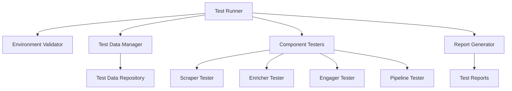

# Design Document: 4Runr AI Lead System Testing Framework

## Overview

The 4Runr AI Lead System Testing Framework is designed to provide comprehensive testing capabilities for the 4Runr AI Lead System, ensuring that all components of the lead generation pipeline function correctly both individually and together. This design document outlines the architecture, components, and interfaces for the testing framework, focusing on end-to-end pipeline validation, component-level testing, environment validation, test data management, reporting, and automation.

## Architecture

The testing framework follows a modular architecture that mirrors the structure of the 4Runr AI Lead System itself. It consists of the following high-level components:

1. **Test Runner**: Orchestrates the execution of tests and manages the overall testing process.
2. **Environment Validator**: Validates the testing environment before tests are run.
3. **Test Data Manager**: Manages the creation, injection, and cleanup of test data.
4. **Component Testers**: Individual testing modules for each component of the lead generation pipeline.
5. **Report Generator**: Generates comprehensive test reports.



## Components and Interfaces

### 1. Test Runner

The Test Runner is the main entry point for the testing framework. It orchestrates the execution of tests and manages the overall testing process.

**Interface:**
- `run_all_tests()`: Runs all tests in the framework
- `run_component_test(component_name)`: Runs tests for a specific component
- `run_pipeline_test()`: Runs the end-to-end pipeline test

**Implementation Details:**
- Implemented as a Python script that can be run from the command line
- Uses a configuration file to determine which tests to run
- Handles test sequencing and dependencies
- Collects and aggregates test results

### 2. Environment Validator

The Environment Validator checks that the testing environment is properly set up before tests are run.

**Interface:**
- `validate_environment()`: Validates the entire environment
- `validate_docker_containers()`: Checks that required Docker containers are running
- `validate_configuration()`: Validates configuration files and environment variables
- `validate_connectivity()`: Checks connectivity to external services

**Implementation Details:**
- Uses Docker API to check container status
- Validates the presence and content of .env files
- Tests connectivity to Airtable and other external services
- Provides detailed error messages for failed validations

### 3. Test Data Manager

The Test Data Manager handles the creation, injection, and cleanup of test data.

**Interface:**
- `create_test_data()`: Creates controlled test data
- `inject_test_data()`: Injects test data into the system
- `cleanup_test_data()`: Removes test data after tests are complete
- `reset_to_known_state()`: Resets the system to a known state

**Implementation Details:**
- Maintains a repository of test data templates
- Generates unique identifiers for test data to prevent collisions
- Tracks created test data for later cleanup
- Implements safeguards to prevent modification of production data

### 4. Component Testers

Component Testers are individual testing modules for each component of the lead generation pipeline.

#### 4.1 Scraper Tester

**Interface:**
- `test_scraper_functionality()`: Tests basic scraper functionality
- `test_scraper_error_handling()`: Tests scraper error handling
- `test_scraper_output_format()`: Validates the format of scraper output

**Implementation Details:**
- Injects test data into the scraper
- Validates the structure and content of generated leads
- Tests error handling for various edge cases

#### 4.2 Enricher Tester

**Interface:**
- `test_enricher_functionality()`: Tests basic enricher functionality
- `test_enricher_error_handling()`: Tests enricher error handling
- `test_enricher_data_enhancement()`: Validates that leads are properly enriched

**Implementation Details:**
- Uses pre-generated test leads as input
- Validates that enrichment adds the expected fields
- Tests handling of various lead formats and edge cases

#### 4.3 Engager Tester

**Interface:**
- `test_engager_functionality()`: Tests basic engager functionality
- `test_engager_error_handling()`: Tests engager error handling
- `test_engager_outreach_logic()`: Validates outreach decision logic

**Implementation Details:**
- Uses pre-enriched test leads as input
- Validates outreach decisions and message generation
- Tests handling of various lead statuses and edge cases

#### 4.4 Pipeline Tester

**Interface:**
- `test_full_pipeline()`: Tests the complete pipeline end-to-end
- `test_data_integrity()`: Validates data integrity between pipeline stages
- `test_pipeline_error_handling()`: Tests pipeline error recovery

**Implementation Details:**
- Orchestrates the sequential execution of pipeline components
- Validates data transformation and integrity between stages
- Tests recovery from component failures

### 5. Report Generator

The Report Generator creates comprehensive test reports.

**Interface:**
- `generate_summary_report()`: Generates a summary of test results
- `generate_detailed_report()`: Generates a detailed test report
- `export_report(format)`: Exports the report in various formats

**Implementation Details:**
- Collects test results from all components
- Formats results into readable reports
- Includes timing information, pass/fail status, and error details
- Supports multiple output formats (console, JSON, HTML)

## Data Models

### Test Configuration

```json
{
  "environment": {
    "docker_containers": ["scraper", "enricher", "engager", "pipeline"],
    "required_env_vars": ["AIRTABLE_API_KEY", "AIRTABLE_BASE_ID", "OPENAI_API_KEY"],
    "external_services": ["airtable", "openai"]
  },
  "test_data": {
    "num_test_leads": 3,
    "include_edge_cases": true,
    "cleanup_after_test": true
  },
  "components": {
    "scraper": {
      "enabled": true,
      "timeout_seconds": 30
    },
    "enricher": {
      "enabled": true,
      "timeout_seconds": 60
    },
    "engager": {
      "enabled": true,
      "timeout_seconds": 60
    }
  },
  "pipeline": {
    "enabled": true,
    "timeout_seconds": 180
  },
  "reporting": {
    "formats": ["console", "json"],
    "include_logs": true,
    "detail_level": "verbose"
  }
}
```

### Test Lead

```json
{
  "id": "test-lead-123",
  "name": "John Test",
  "company": "Acme AI",
  "linkedin_url": "https://linkedin.com/in/fakejohnsmith",
  "title": "CTO",
  "email": null,
  "status": "new",
  "needs_enrichment": true,
  "is_test_data": true,
  "created_at": "2025-07-23T10:00:00Z"
}
```

### Test Result

```json
{
  "test_id": "pipeline-test-20250723-1",
  "timestamp": "2025-07-23T10:15:30Z",
  "overall_status": "passed",
  "duration_seconds": 45,
  "component_results": [
    {
      "component": "environment_validation",
      "status": "passed",
      "duration_seconds": 2,
      "details": "All environment checks passed"
    },
    {
      "component": "scraper",
      "status": "passed",
      "duration_seconds": 10,
      "details": "Generated 3 test leads successfully"
    },
    {
      "component": "enricher",
      "status": "passed",
      "duration_seconds": 15,
      "details": "Enriched 3 leads successfully"
    },
    {
      "component": "engager",
      "status": "passed",
      "duration_seconds": 18,
      "details": "Processed 3 leads for outreach"
    }
  ],
  "errors": [],
  "warnings": ["Airtable API response was slower than expected (1.5s)"],
  "logs": "..."
}
```

## Error Handling

The testing framework implements a comprehensive error handling strategy:

1. **Test Failures**: Clearly distinguished from system errors, with detailed information about expected vs. actual results
2. **Environment Errors**: Detected during environment validation, with clear instructions for resolution
3. **Component Errors**: Captured and reported with component-specific context
4. **Data Errors**: Handled gracefully with clear indications of data issues

All errors are logged with appropriate context and include:
- Error type and severity
- Component and test case where the error occurred
- Expected vs. actual behavior
- Relevant log excerpts
- Recommendations for resolution

## Testing Strategy

### End-to-End Testing

End-to-end tests validate the complete pipeline by:
1. Setting up a clean test environment
2. Injecting controlled test data
3. Running the complete pipeline (scraper → enricher → engager)
4. Validating the output at each stage
5. Verifying data integrity between stages
6. Checking final results against expected outcomes

### Component Testing

Component tests focus on individual modules:
1. Isolating the component from the rest of the system
2. Providing controlled inputs
3. Validating outputs against expected results
4. Testing error handling and edge cases
5. Measuring performance and resource usage

### Environment Validation

Environment validation ensures that:
1. All required Docker containers are running and healthy
2. Configuration files are present and properly formatted
3. Environment variables are set correctly
4. External services are accessible
5. The system is in a clean state for testing

## Deployment and Execution

### Local Execution

The testing framework can be run locally using the following command:

```bash
python test_runner.py --config test_config.json
```

This will:
1. Load the specified configuration
2. Validate the environment
3. Run the specified tests
4. Generate and display test reports

### Automated Execution

For automated testing, the framework provides:

1. **CI/CD Integration**: Scripts compatible with common CI/CD platforms
2. **Scheduled Execution**: Support for cron-based scheduling
3. **Non-interactive Mode**: Command-line flags for headless execution
4. **Exit Codes**: Standard exit codes indicating test success/failure

```bash
# Example CI/CD command
python test_runner.py --config ci_test_config.json --non-interactive --report-format json --output-file test_results.json
```

### Docker Integration

The testing framework can be run in a Docker container:

```bash
docker run --network 4runr-network -v ./test_config.json:/app/test_config.json 4runr/test-framework:latest
```

This approach ensures that the testing environment is consistent and isolated.

## Security Considerations

1. **API Key Protection**: The framework never exposes API keys or credentials
2. **Test Data Isolation**: Test data is clearly marked and isolated from production data
3. **Resource Limitations**: Tests are designed to limit resource usage to prevent DoS-like conditions
4. **Clean Teardown**: All test artifacts are removed after test completion

## Future Considerations

While not part of the initial implementation, the design accounts for future extensions:

1. **Performance Testing**: Adding capabilities to measure and report on system performance
2. **Load Testing**: Simulating high-volume scenarios to test system scalability
3. **Security Testing**: Adding tests for security vulnerabilities
4. **Regression Test Suite**: Building a comprehensive suite of regression tests
5. **Test Data Generation**: More sophisticated test data generation based on production patterns